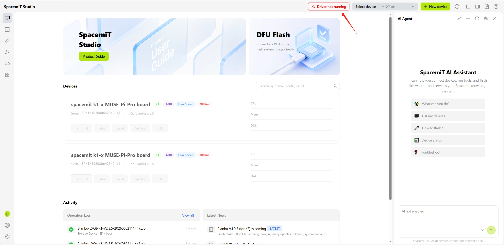
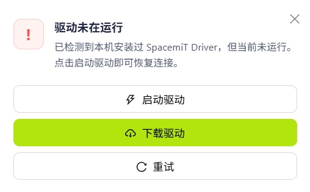
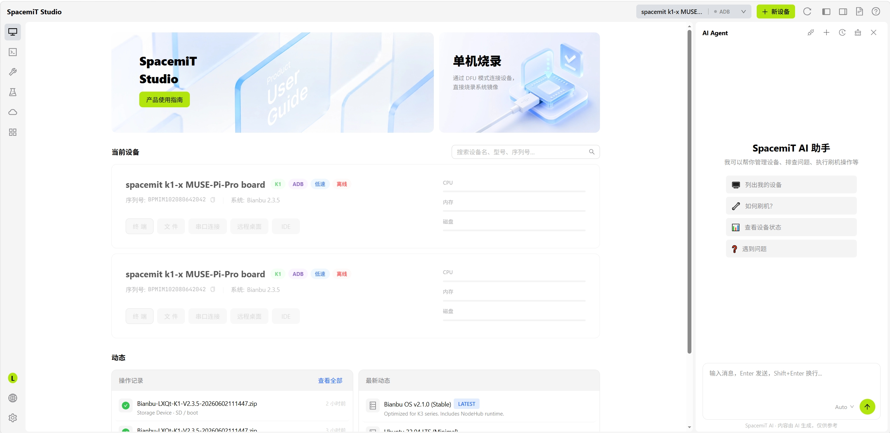
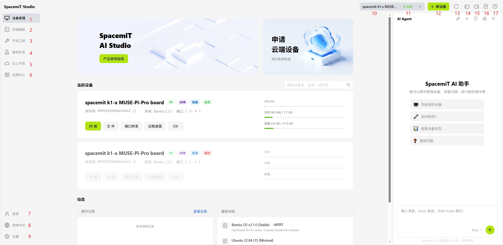
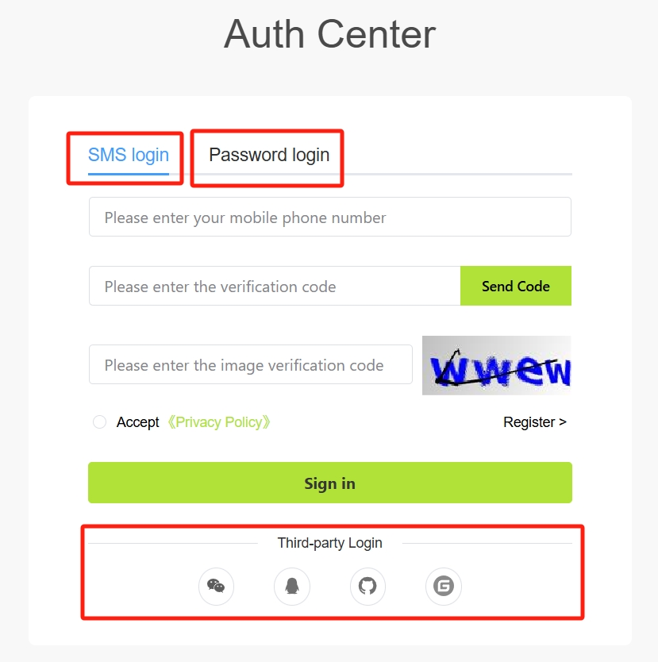
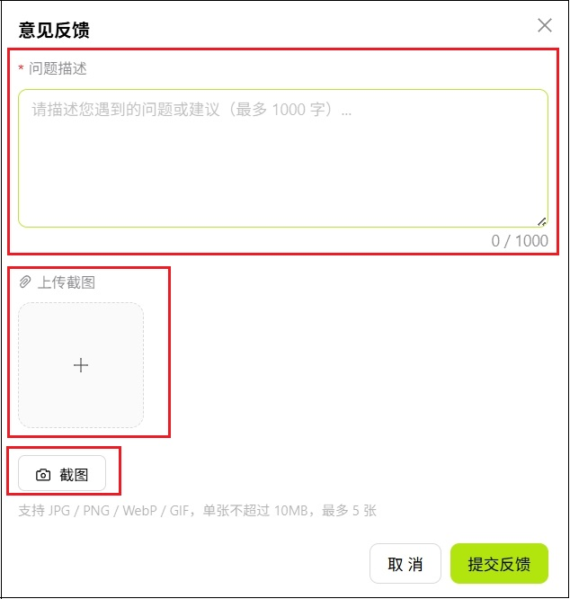
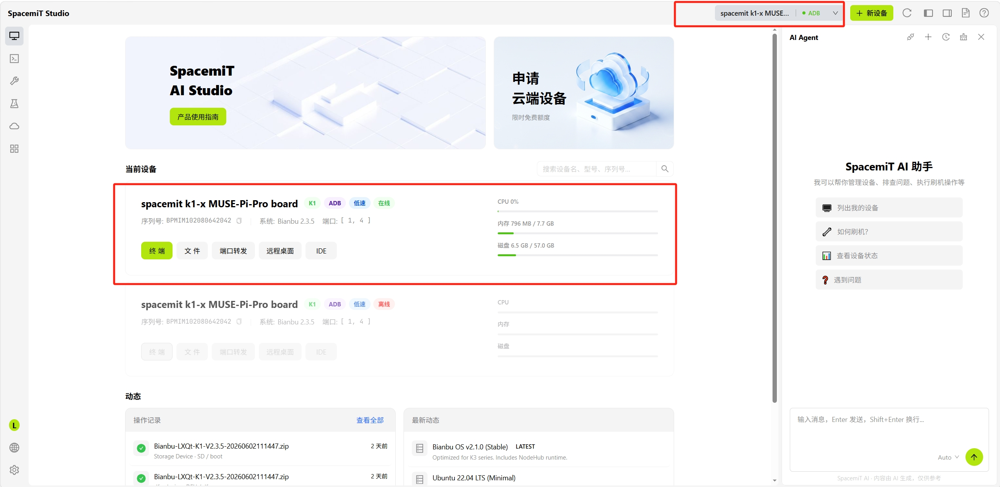

# 快速入门

本章介绍如何访问 SpacemiT Studio、完成注册、安装驱动以及首次连接设备。

## 访问 SpacemiT Studio

在浏览器中打开 **[SpacemiT Studio](https://studio.spacemit.com/)** 即可开始使用。

## 安装驱动

首次启动 SpacemiT Studio 时，如果尚未安装驱动，首页显示 **驱动未在运行** 提示：

点击提示后，将弹出 SpacemiT Studio 的驱动安装引导窗口，提供以下三个操作：

- **启动驱动**：若驱动已安装但未运行，点击此项可直接启动驱动服务
- **下载驱动**：若尚未安装驱动，点击此项下载并安装对应平台的驱动包
- **重试**：驱动操作失败时可重试

驱动安装成功后，提示将消失，首页状态恢复为可连接设备的正常状态。

> 注：各平台的驱动安装包也可以通过以下链接手动下载并安装。
> TBD

## 界面导航

### 左侧导航栏（Sidebar）

左侧导航栏提供所有功能模块的入口，点击图标即可切换页面：

| # | 图标名称 | 说明 |
|------|------|------|
| 1 | **[设备管理](./user_guide/devices.md)** | 查看已连接设备的状态与基本信息，默认首页 |
| 2 | **[终端面板](./user_guide/terminal.md)** | SSH / 串口终端，支持多标签管理 |
| 3 | **[开发工具](./user_guide/dev_tools/index.md)** | 系统烧录、SD 卡制作、系统预配置等工具 |
| 4 | **[案例开发](./user_guide/cases.md)** | 官方示例工程，一键部署到设备 |
| 5 | **[云上开发](./user_guide/cloud.md)** | 云端编译环境，无需本地配置交叉编译工具链 |
| 6 | **[应用中心](./user_guide/app_store.md)** | 生态应用的浏览与安装 |

底部提供三个全局设置：

| # | 图标名称 | 说明 |
|------|------|------|
| 7 | **[登录](#登录)** | 用户账号登录入口 |
| 8 | **语言** | 切换界面显示语言，支持中文 / 英文 |
| 9 | **[设置](./user_guide/settings.md)** | 打开应用设置 |

#### 登录

**注册账号**

如果还没有账号，点击 **登录** 进入注册流程。

当前平台支持以下注册方式：

- 手机号注册（目前仅支持中国国内手机号）
  

- 邮箱注册
  

注册完成后，点击 **立即登录** 进入登录页面。

平台支持以下登录方式：

- 短信登录
- 密码登录

  

### 顶部工具栏（Topbar）

| # | 图标名称 | 说明 |
|------|------|------|
| 10 | **设备名称下拉框** | 显示当前活跃设备，点击可切换已连接的其他设备 |
| 11 | **状态指示** | 实时显示设备在线 / 离线状态 |
| 12 | **＋ [新设备](./user_guide/devices.md#新设备)** | 添加新设备连接（USB / SSH） |
| 13 | **刷新** | 刷新当前设备列表 |
| 14 | **收起侧栏** | 隐藏 / 显示左侧导航栏 |
| 15 | **收起 AI 面板** | 隐藏 / 显示右侧 AI 助手面板 |
| 16 | **文件** | 跳转至进迭时空的官方文档中心 |
| 17 | **意见反馈** | 打开反馈弹窗，提交问题、建议或异常日志 |

#### 意见反馈

点击 **意见反馈** 后，将弹出反馈窗口：

- 在“问题描述”文本框中输入您遇到的问题或改进建议，最多 1000 字
- 点击“上传截图”区域选择图片文件，或将图片拖拽到该区域上传
- 支持 JPG / PNG / WebP / GIF 格式，单张不超过 10MB，最多上传 5 张
- 点击下方的 **截图** 按钮，可直接截取当前屏幕并上传
- 输入联系方式（邮箱 / 手机号），便于客服回复

提交后，系统会自动收集当前版本号和设备信息，帮助加快问题定位。

反馈成功后，页面会显示“提交成功”提示。

> 如果提交失败，请检查网络状况后重试。

## 连接设备

SpacemiT Studio 支持以下开发板连接方式：

| 连接方式 | 适用场景 | 说明 |
|---------|---------|------|
| USB | 烧录、本地调试 | 免配置，即插即用 |
| SSH | 远程开发、文件同步 | 需设备已联网 |

连接成功后，设备将出现在顶部工具栏的设备下拉列表中，首页也会同步显示其详细信息：

## 下一步

- [设备管理](./user_guide/devices.md) — 了解设备的详细管理功能
- [终端面板](./user_guide/terminal.md) — 开始使用终端调试
- [开发工具](./user_guide/dev_tools/index.md) — 系统烧录与镜像管理
