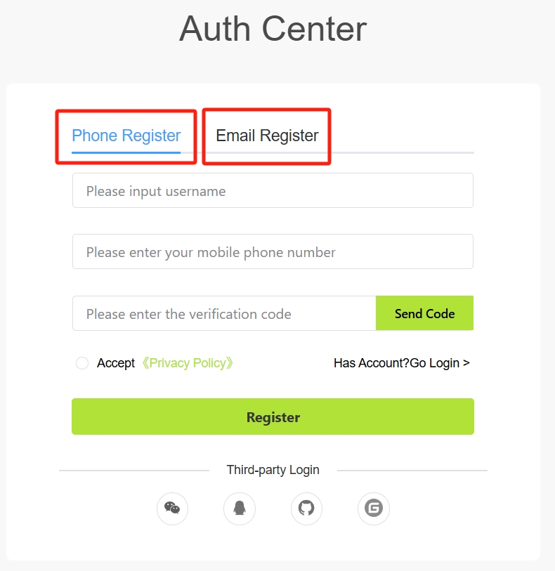
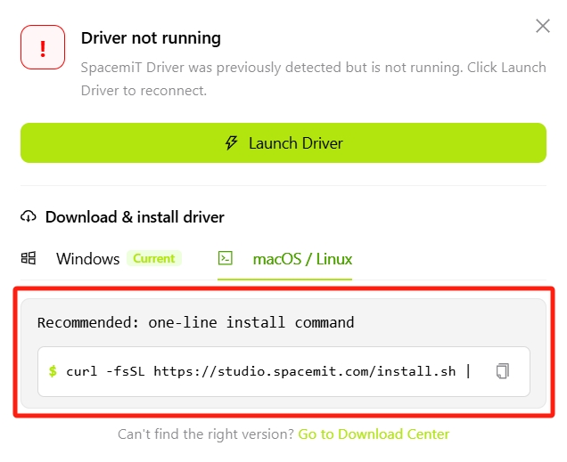
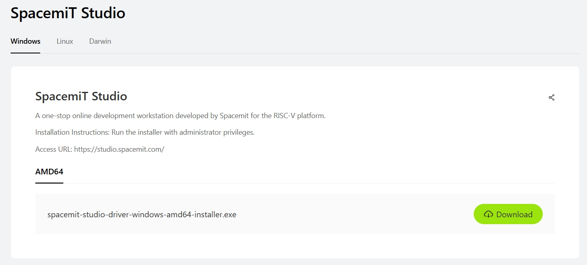

# Quick Start

This section describes how to access SpacemiT Studio, register an account, install the driver, and connect a device for the first time.

## Access SpacemiT Studio

Open **[SpacemiT Studio](https://studio.spacemit.com/)** in a web browser.

> Note: Login to access the main Studio interface. Otherwise, Studio redirects you to the sign-in page.

## Login

### Register an Account

If you do not have an account, you can register with either of the following methods:

- Register with a mobile number (currently supports only mobile numbers registered in mainland China)
- Register with an email address

After registration, go to the Login page.
> You can also login with a third-party account without registering separately.

### Login Methods

You can login using the following methods:

- SMS verification code
- Password
- Third-party account login (no separate registration required)
  - WeChat
  - QQ
  - GitHub
  - Gitee

## Driver Installation

When you first start SpacemiT Studio, the home page displays a **Service not started** message if the driver is not installed:

Click the message to open the SpacemiT Studio driver installation wizard, which provides the following options:

- **Launch Driver**: Starts the driver service if the driver is installed but not running.
- **Download & install driver**: Downloads and installs the driver package for the current platform if the driver is not installed.
  - Click **Download** to download the SpacemiT Studio Windows driver.
  - For macOS/Linux driver installation, copy and run the displayed command.
    

  - To download a driver package manually, click **Go to Download Center**.
    

    | Platform | Download |
    | --- | --- |
    | Windows | [Download the Windows driver](https://www.spacemit.com/community/resources-download/Tools/SpacemiT%20Studio/Windows) |
    | Linux | [Download the Linux driver](https://www.spacemit.com/community/resources-download/Tools/SpacemiT%20Studio/Linux) |
    | macOS | [Download the macOS driver](https://www.spacemit.com/community/resources-download/Tools/SpacemiT%20Studio/Darwin) |

After the driver is installed successfully, the message disappears and the home page returns to its normal state, ready to connect a device.

## Interface Navigation

### Left Navigation Bar (Sidebar)

The left navigation bar provides access to all feature modules. Click an icon to switch pages:

| # | Icon | Description |
|------|------|------|
| 1 | **[Devices](./user_guide/devices.md)** | View the status and basic information of connected devices. This page is the SpacemiT Studio homepage by default. |
| 2 | **[Terminal](./user_guide/terminal.md)** | SSH and serial terminals with multi-tab support. |
| 3 | **[Development Tools](./user_guide/dev_tools/index.md)** | Tools for system flashing, SD card creation, system preconfiguration, and more. |
| 4 | **[Development Cases](./user_guide/cases.md)** | Sample projects provided by SpacemiT. Deploy a project to a device with one click. |
| 5 | **[Cloud Development](./user_guide/cloud.md)** | Cloud-based build environment that does not require a locally configured cross-compilation toolchain. |
| 6 | **[App Center](./user_guide/app_store.md)** | Browse and install ecosystem applications. |

The following global settings are available at the bottom of the navigation bar:

| # | Icon | Description |
|------|------|------|
| 7 | **User** | View and edit your user profile. |
| 8 | **Language** | Select the interface language. Chinese and English are supported. |
| 9 | **[Settings](./user_guide/settings.md)** | Open application settings. |

### Top Toolbar

| # | Icon | Description |
|------|------|------|
| 10 | **Device Name Drop-Down** | Displays the active device. Click to switch to another connected device. |
| 11 | **Status Indicator** | Shows the device's online status in real time. |
| 12 | **+ [New Device](./user_guide/devices.md#new-device)** | Add a device connection over USB or SSH. |
| 13 | **Refresh** | Refresh the current device list. |
| 14 | **Collapse Sidebar** | Hide or show the left navigation bar. |
| 15 | **Collapse AI Panel** | Hide or show the AI assistant panel on the right. |
| 16 | **Documentation** | Open the user guide. |
| 17 | **[Feedback](#feedback)** | Open the feedback dialog to submit issues, suggestions, or error logs. |

#### Feedback

Click **Feedback** to open the feedback dialog:

- Enter the issue or improvement suggestion in the **Description** field, up to 1,000 characters.
- Click the **Images** area to select image files locally.
- Click Screenshot icon to capture and upload the current screen.

After you submit feedback, the system automatically collects the current version and device information to help diagnose the issue.

After submission, the page displays a **Submitted Successfully** message.

> If submission fails, check your network connection and try again.

## Connect a Device

SpacemiT Studio supports the following development board connection methods:

| Connection Method | Use Case | Description |
|---------|---------|------|
| USB | Flashing and local debugging | Plug and play; no configuration required. |
| SSH | Remote development and file synchronization | The device must be connected to a network. |

After a connection is established, the device appears in the device drop-down list on the top toolbar, and the home page displays its details:

## Next Steps

- [Device Management](./user_guide/devices.md) - Learn about detailed device management capabilities.
- [Terminal](./user_guide/terminal.md) - Start terminal debugging.
- [Development Tools](./user_guide/dev_tools/index.md) - Flash a system image and manage images.
