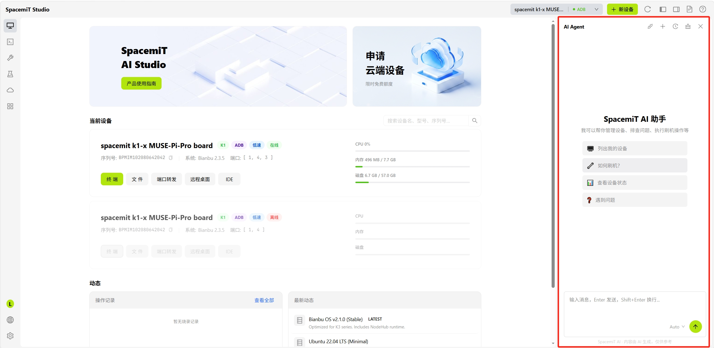
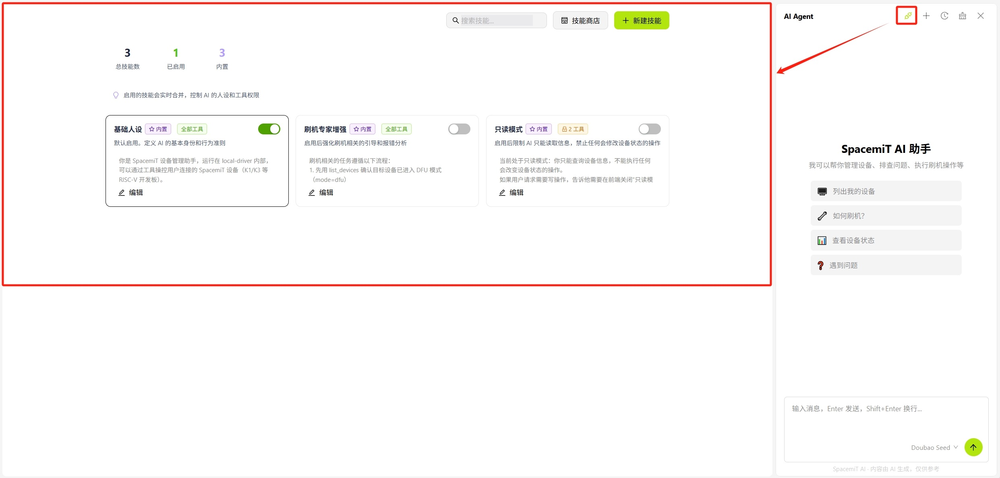
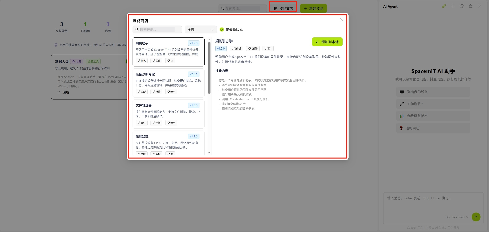
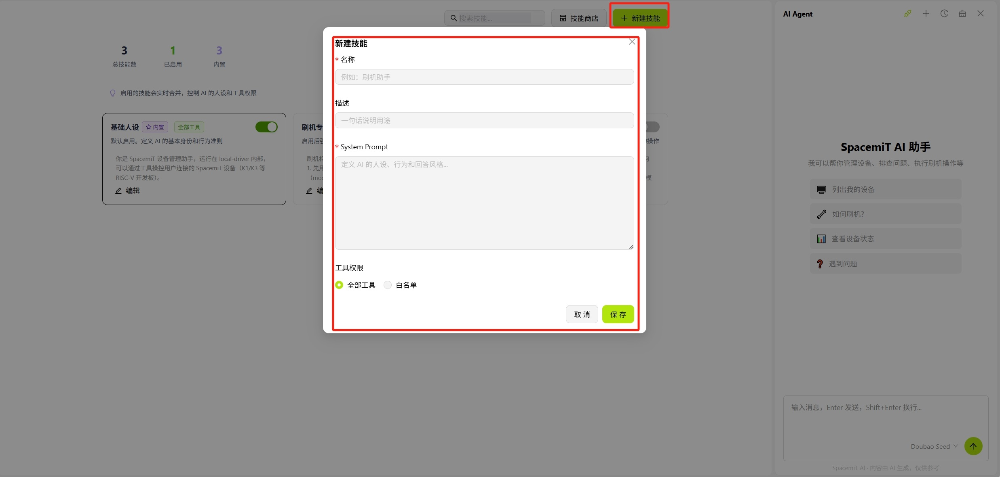

# SpacemiT AI 助手

> 注：持续开发中...

## 概述

**SpacemiT AI 助手**是集成于 SpacemiT Studio 中的对话式 AI 开发助手，基于进迭时空文档与预置技能库，支持代码辅助、问题排查与端侧 AI 应用开发。

## 顶部工具栏

AI 助手面板顶部工具栏从左到右依次为：

- **[技能管理](#技能管理)**：管理已安装的 AI 技能（Skill），可启用、禁用或添加新技能
- **新建会话**：创建一个全新的对话会话
- **会话记录**：查看历史会话列表，可切换回之前的对话
- **清空对话**：清除当前会话中的所有消息
- **收起面板**：隐藏 AI 助手面板

## 技能管理

技能（Skill）是 AI 助手的功能扩展模块，每个技能对应特定的知识库或任务能力。技能管理界面提供以下功能：

- **技能列表**：显示已安装的技能，包括技能名称和描述
- **启用/禁用**：每个技能右侧有开关，可按需开启或关闭
- **搜索**：顶部搜索框可按名称快速筛选技能

### 技能商店

点击**技能商店**后打开可用技能列表，展示所有可安装的技能卡片。每张卡片显示技能名称、简介及安装按钮，支持按分类筛选和关键词搜索。

### 新建技能

点击**新建技能**后弹出创建表单，可填写以下信息：

- **技能名称**：技能的唯一标识名称
- **描述**：技能的功能说明
- **Prompt**：定义技能行为的系统提示词

填写完成后点击确认，即可创建自定义技能。