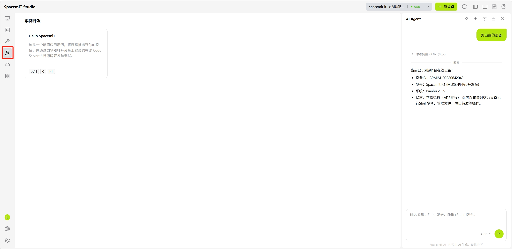
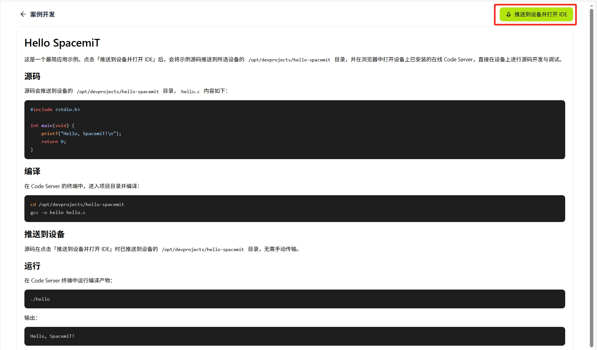
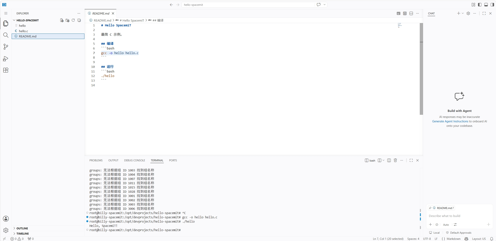

# 案例

> 注：持续增加更多案例中...

## 概述

案例页面提供预置的示例工程和应用开发参考，帮助开发者快速了解 SpacemiT 平台能力并上手开发。

进入 **案例开发** 页面后，可以看到预置的示例卡片（如 **Hello SpacemiT**），每个卡片会标注适用的系统类型（如 C）与设备系列（如 K1）。

点击案例卡片进入详情页，页面会展示该案例的说明、源码内容、编译命令与运行命令。点击右上角 **推送到设备并打开 IDE**，会将示例源码推送到所选设备的指定目录（如 `/opt/devprojects/hello-spacemit`），并在浏览器中打开设备上已安装的在线 Code Server。

推送完成后，会自动打开在线 IDE，可以在文件浏览器中看到已推送的项目文件（如 `hello.c`、`README.md`）。在内置终端中执行编译与运行命令后，即可直接在设备上查看输出结果，无需手动传输代码或额外配置开发环境。

