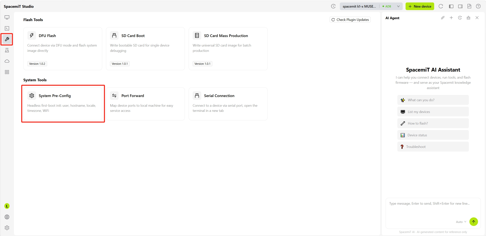
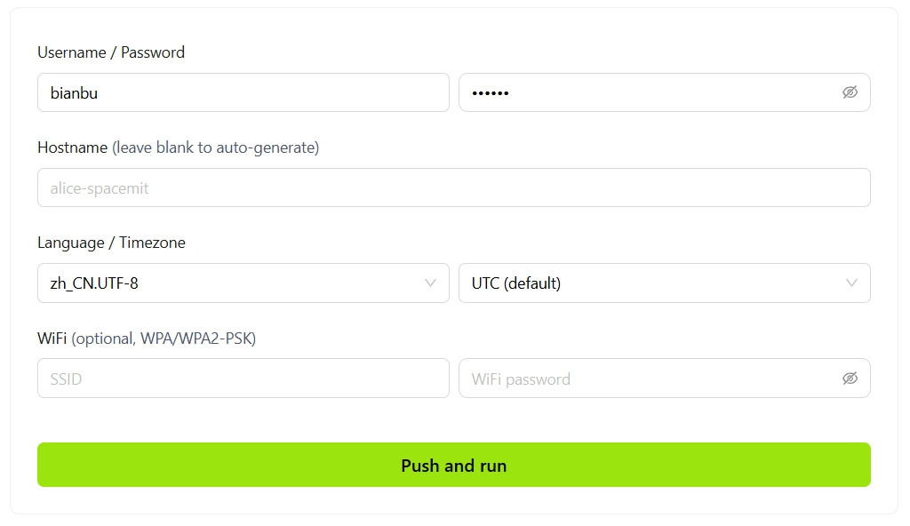
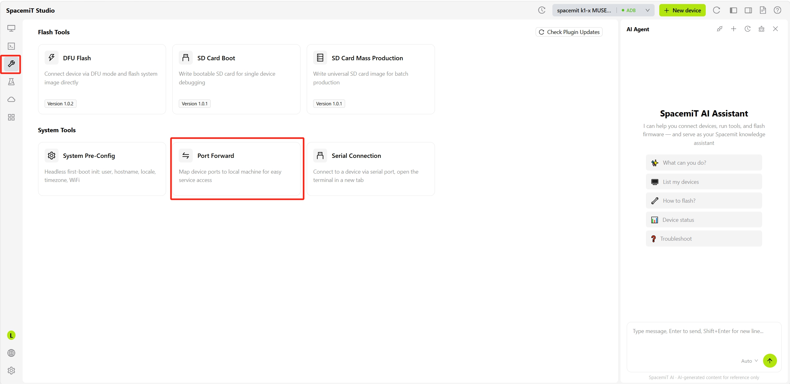
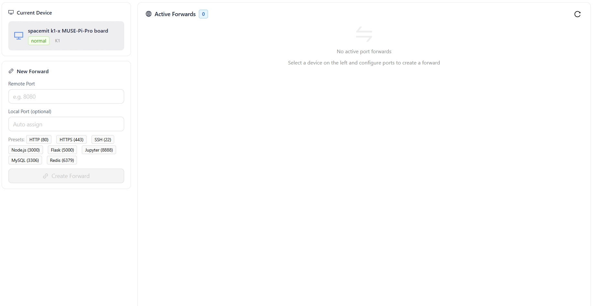
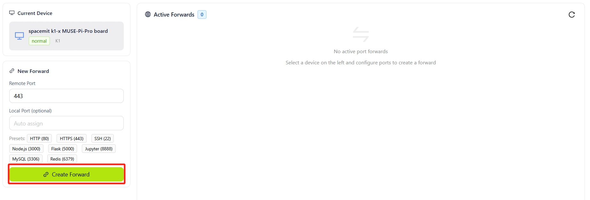
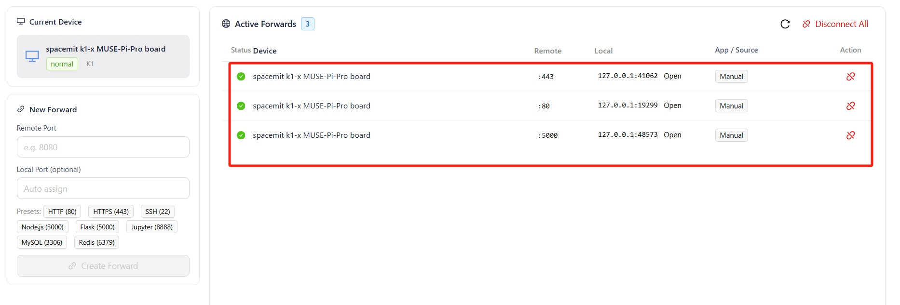
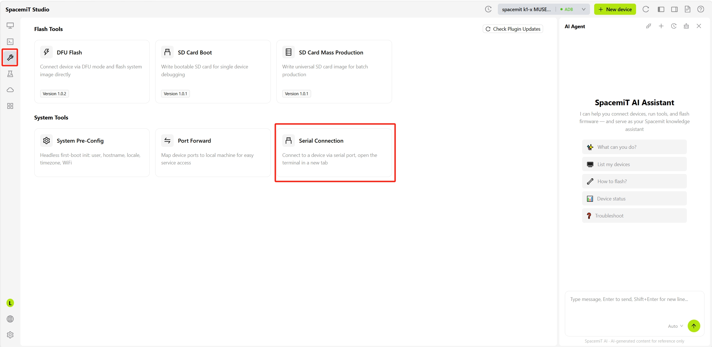

# System Tools

## System Preconfiguration

A headless initialization tool that presets system parameters before the device's first boot. Basic configuration can be completed without a monitor or keyboard.

### Procedure

1. Go to **Development Tools → System Preconfiguration**.

   

2. Specify the configuration fields to preset:

   

   - **Username / Password**: Sets the system login credentials.
   - **Hostname**: A custom device name. If left blank, the hostname is generated automatically.
   - **Language / Timezone**: The system display language and timezone. The timezone defaults to UTC.
   - **WiFi**: Optional. Enter the SSID and password (WPA/WPA2-PSK supported) to connect automatically on first boot.

3. Click **Push and Run**. The configuration is written to the connected device and applied automatically on first boot.

## Port Forwarding

Maps a device port to the local machine, enabling access to services running on the device from a local browser or tool.

### Use Cases

- Accessing web services on the device (such as HTTP/HTTPS applications)
- Debugging development services on the device, such as Node.js or Flask
- Connecting to services on the device, such as Jupyter, MySQL, or Redis

### Port Forwarding Procedure

1. Ensure the device is connected and appears in the **Current Device** panel.
2. Go to **Development Tools → Port Forward**.

   

3. Fill in the forwarding rule in the **New Forward** panel:

   

    - **Remote Port**: The device port number to forward (for example, 8080).
    - **Local Port**: The local port number to map. If left blank, a port is assigned automatically.
       Common ports can also be selected using shortcut tags: HTTP (80), HTTPS (443), SSH (22), Node.js (3000), Flask (5000), Jupyter (8888), MySQL (3306), and Redis (6379).

4. Click **Create Forward**.

   

5. After the forward is created, it appears in the **Active Forwards** list on the right. Access the device service at `localhost:<local port>`.

   

## Serial Connection

Enables command-line interaction and system debugging through a serial connection to the device.

### Serial Connection Use Cases

- Viewing device boot logs and performing system debugging
- Controlling the device in environments without network access
- Bootloader interaction and low-level system configuration
- Embedded development and driver debugging

### Serial Connection Procedure

1. Ensure the device is connected to the computer over a serial connection.
2. Go to **Development Tools → Serial Connection**.

   

3. Configure the serial parameters:

   

   - **Serial Port**: Select the serial port corresponding to the device (for example, COM3 or /dev/ttyUSB0).
   - **Baud Rate**: Sets the communication speed. The common value is 115200.

4. Click **Connect**. After the connection is established, interact with the device through the terminal window.
