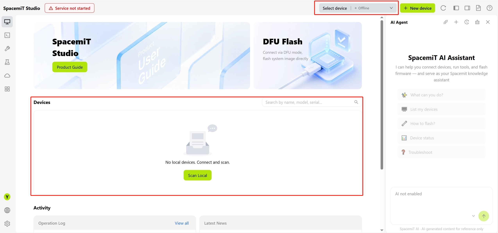
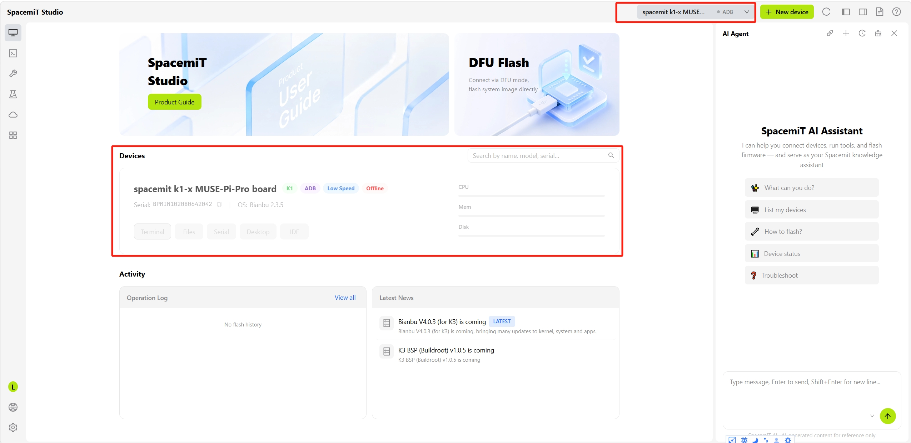
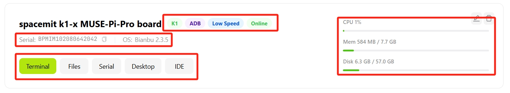
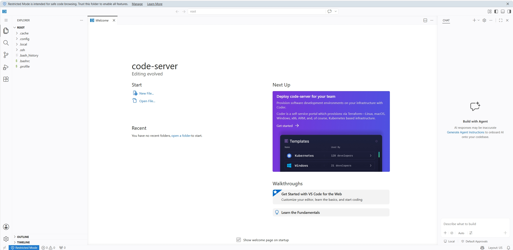
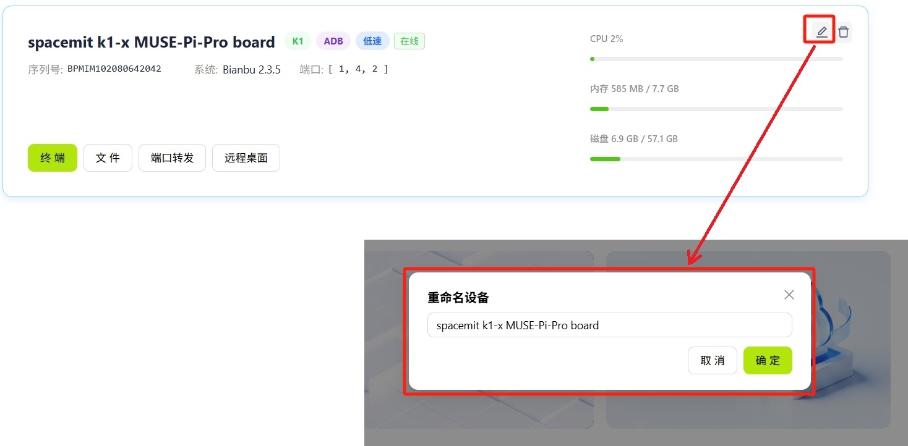
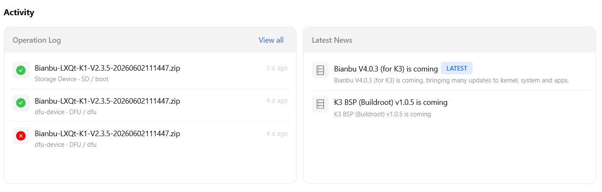

# Device Management

## Overview

The Device Management panel centrally manages all connected development boards. It supports simultaneous connection of multiple devices, status monitoring, and quick switching.

## Supported Devices

| Series | Models |
|------|------|
| K1 | MUSE Pi Pro、MUSE Pi、MUSE Book、MUSE Paper |
| K3 | CoM260 Kit、Pico-ITX |

## Device Connection

The following connection methods are supported:

| Connection Method | Use Case | Description |
|---------|---------|------|
| USB | Flashing and local debugging | Direct USB cable connection; no configuration required |
| SSH | Daily development and file synchronization | Remote network connection; the device must be connected to a network |

### Before Connection

When no device is connected, the home page displays an empty state:

Alternatively, a device that was previously connected may be displayed as offline:

### Successful Connection

After a device is connected successfully, the home page displays detailed information about the current device:

## Device Operations

### Device Information

After a device is connected successfully, the following information is available:

- Device series and serial number
- Currently installed operating system, such as Bianbu
- Device connection method, such as ADB
- Online/offline status
- CPU utilization, in real time
- Used memory / total memory
- Used storage / total storage

### Quick Actions

The bottom of the device panel provides shortcut buttons for common operations:

- **[Terminal](./terminal.md#terminal-sessions)**: Opens a terminal session for the device
- **[Files](./terminal.md#file-management)**: Opens device file management
- **[Serial Connection](./dev_tools/system_tools.md#serial-connection)**: Communicates with the device over a serial connection for low-level debugging and log viewing
- **Remote Desktop**: Accesses the device graphical interface through VNC/RDP
   
- **IDE**: Opens the device integrated development environment in Studio
   

### Rename Device

Connected devices can be assigned custom names to distinguish them when managing multiple devices:

### New Device

To add a device, click **+ New Device** and follow the steps in the **Connect Your Device** dialog to connect a local device.
At the bottom of the dialog, select either USB or SSH as the connection method.

## Activity

The Activity page consolidates two types of information:

- **Operation Log**: Historical operation logs for the current device, including package name, operation method, execution time, and success/failure status. Click **View All** in the upper-right corner to expand the complete history.
- **Latest News**: Platform-provided update information
