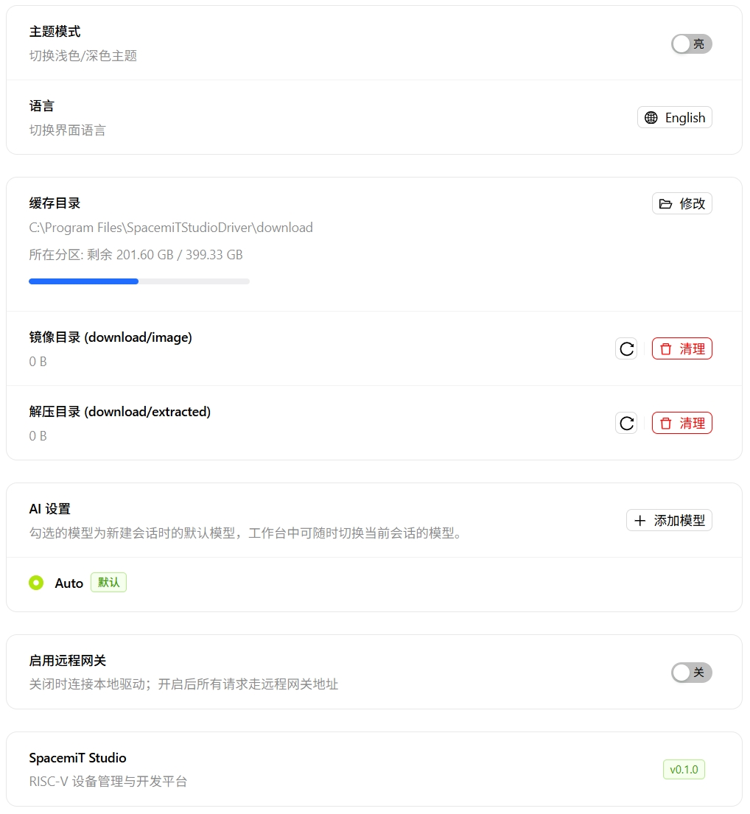
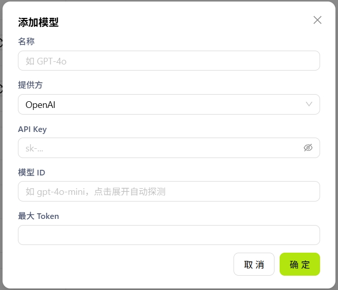
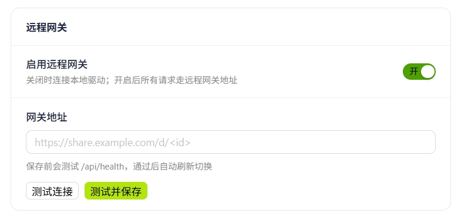

# 设置

点击 ⚙️ 图标进入设置页面，可管理 SpacemiT Studio 的外观、缓存、AI 模型及远程网关等配置。

## 外观

- **主题模式**：切换亮色 / 深色主题。
- **语言**：切换界面语言（中文 / 英文）。

## 缓存管理

- **缓存目录**：点击**修改**更改默认下载与存储路径，建议设为非系统盘。
- **镜像目录**：点击**清理**删除已下载的原始镜像文件，清理后如需使用须重新下载。
- **解压目录**：点击**清理**删除已解压的文件，清理前请确认相关项目不再依赖该目录。

## AI 设置

- **添加模型**：点击 **+ 添加模型**，填写以下信息后点击**确定**：
  
  - **名称**：自定义的模型显示名称。
  - **提供方**：模型服务商（如 OpenAI、字节跳动等）。
  - **API Key**：用于鉴权的密钥。
  - **模型 ID**：实际调用的模型标识符（如 `gpt-4o`、`doubao-seed-1-6`）。
  - **最大 Token**：单次请求允许的最大 Token 数，留空则使用服务商默认值。

## 远程网关

- **关闭（默认）**：直连本地驱动，适用于本机开发调试。
- **开启**：启用后需填写以下信息并点击**测试并保存**：
  - **网关地址**：远程网关的访问地址。
  

## 关于

显示 SpacemiT Studio 当前软件版本信息。
