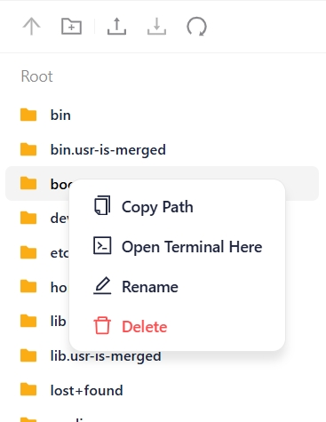
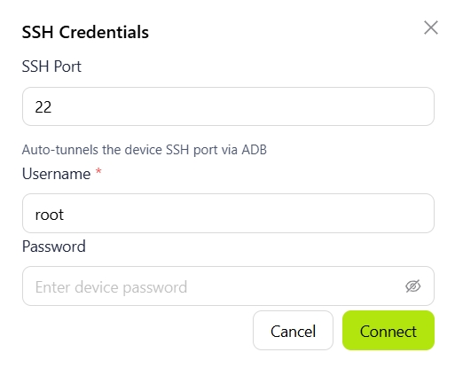
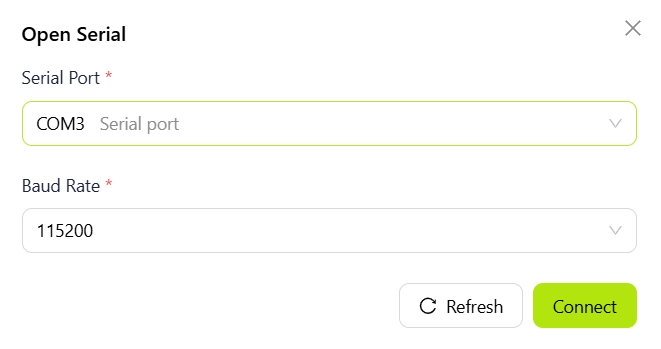

# Terminal

The Terminal panel provides an integrated command-line environment for interacting with devices over SSH or a serial connection, without switching to an external terminal application.

> Note: A device must be connected.

## File Management

The File Management panel on the left provides access to the device file system.

The toolbar at the top of the panel provides common actions, including refreshing directories, creating folders, uploading files, and downloading files. Right-click a file or directory to open a context menu with the following actions:

- **Refresh**: Refreshes the current directory.
- **New Folder**: Creates a folder in the current directory.
- **Upload**: Creates a file in the current directory.
- **Download**: Downloads the selected file to the local system.

## Terminal Sessions

The Terminal Sessions area on the right provides a command-line environment with multi-tab support. Each tab corresponds to an independent session.

### Toolbar

The terminal toolbar provides the following actions:

- **+**: Creates a new terminal tab.
- **SSH**: Connects to the device over SSH and opens a remote terminal. Select this option to open the configuration dialog, then enter the SSH port, username, and password to connect.
  
- **ADB**: Connects to the device through the ADB protocol and opens a debugging shell.
- **Open Serial**: Opens a serial terminal for viewing boot logs and performing low-level debugging. Select this option to open the configuration dialog, choose a serial device, configure the baud rate and other parameters, then connect.
  
- **FullScreen**: Switches the terminal area to full-screen mode.
