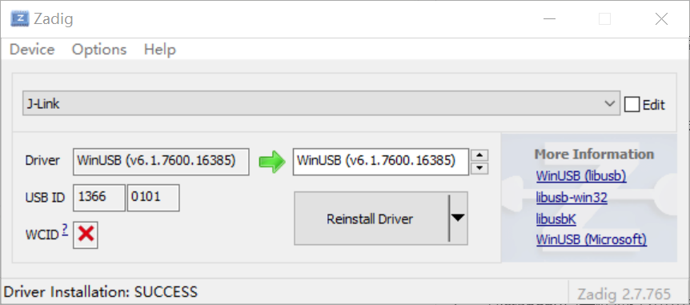
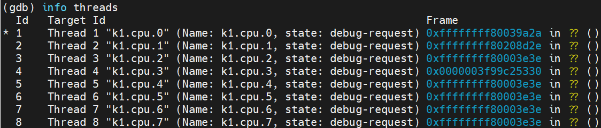
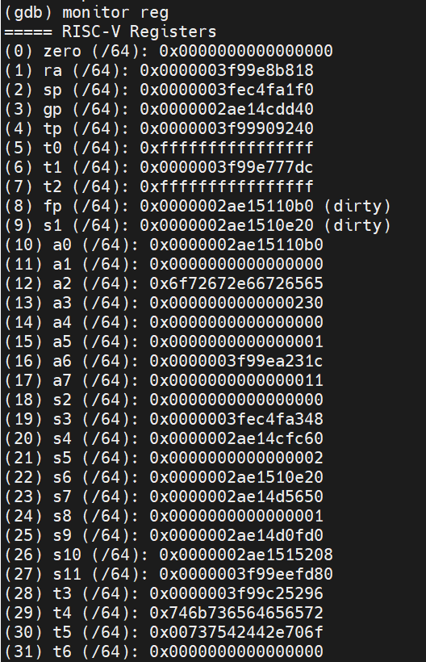

# JTAG Debugging Tool User Guide

## 1. Download

- **OpenOCD download link**: <u>[https://archive.spacemit.com/tools/openocd](https://archive.spacemit.com/tools/openocd)</u>

- **GDB**:
  Included in the cross-compilation toolchain.
  Please refer to the *Cross-Compilation Toolchain User Guide*:
  [https://developer.spacemit.com/documentation?token=S66mw1ouRio4dUkqGvkcw7LEnJh](https://developer.spacemit.com/documentation?token=S66mw1ouRio4dUkqGvkcw7LEnJh)

## 2. Configure the JTAG Interface

All K1-series boards include built-in JTAG debugging support.
To enable it, you need to complete **hardware setup** and **USB driver configuration**.

The steps below use **J-Link** as an example.

### 2.1 Hardware Setup

1. Open the J-Link casing and remove the jumper cap to **disable power output** from J-Link.
2. Connect the JTAG signals and check that the pins are correctly used.
   Refer to the *MUSE Pi User Guide*:
   JTAG Debug Interface section
   [https://developer.spacemit.com/documentation?token=ZugWwIVmkiGNAik55hzc4C3Ln6d](https://developer.spacemit.com/documentation?token=ZugWwIVmkiGNAik55hzc4C3Ln6d)

### 2.2 USB Driver Setup

#### Windows

1. Download and run the **Zadig** tool from:
   [https://zadig.akeo.ie/](https://zadig.akeo.ie/)
2. In Zadig, open the **Options** menu and enable **List All Devices**.
3. Locate the **J-Link** device in the list and update its driver to **WinUSB**.



4. After successful installation, the J-Link device will appear under **Universal Serial Bus devices** in Device Manager.

**Note**:
If multiple drivers exist (e.g., SEGGER native driver), the OS may switch back to another driver after re-plugging the device.
In that case, manually select **WinUSB** again from the list of available drivers.

#### Linux

1. Grant access permission for USB devices supported by OpenOCD by copying the following udev rules file into `/etc/udev/rules.d`:
   [https://github.com/riscv-collab/riscv-openocd/blob/riscv/contrib/60-openocd.rules](https://github.com/riscv-collab/riscv-openocd/blob/riscv/contrib/60-openocd.rules)
2. Reload udev rules:

```bash
udevadm control --reload
```

3. Reconnect the J-Link device to apply the new rules.

## 3. Running OpenOCD

1. Extract the downloaded OpenOCD package.
2. In the `bin` directory, double-click **spacemit_k1_2x4** to start OpenOCD.
3. To change runtime parameters, edit the startup script.
   Example (Linux):

```bash
#!/bin/bash

SCRIPT_DIR="../share/openocd/scripts"

./openocd -c "set CORES 8" \
          -f $SCRIPT_DIR/interface/jlink.cfg \
          -f $SCRIPT_DIR/target/spacemit-k1.cfg \
          -c "gdb_port 1024"
```

- `-f` loads configuration files for the J-Link adapter and the K1 target.
- `-c` sets OpenOCD options, such as:

  - GDB debug port (`gdb_port 1024`)
  - Number of cores to debug (`CORES`)

## 4. Debugging with GDB

Use `riscv64-unknown-linux-gnu-gdb` and connect to OpenOCD:

```bash
target remote <ip>:<port>
```

### 4.1 Debugging Using Standard GDB Commands

- Run `info threads` to check whether all 8 threads (CPU cores) are in debug mode.
  Then continue using normal GDB commands.



- Example: view registers of CPU core `k1.cpu.3`:

```bash
thread 4
info all-registers
```


### 4.2 Debugging Using OpenOCD Commands in GDB

- Use `monitor` commands inside GDB.
  For example, check whether all 8 CPU cores are in the **halted** state:

```bash
monitor targets
```

- Continue using standard OpenOCD commands.

- Example: switch to CPU core `k1.cpu.3` and read its registers:

```bash
monitor targets 3
monitor reg
```


