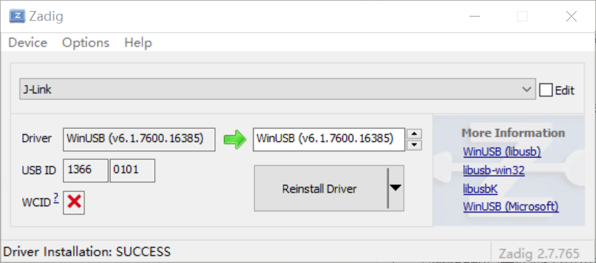
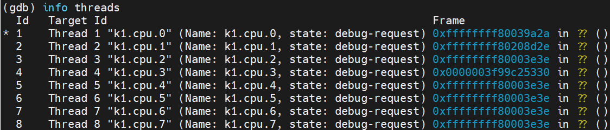
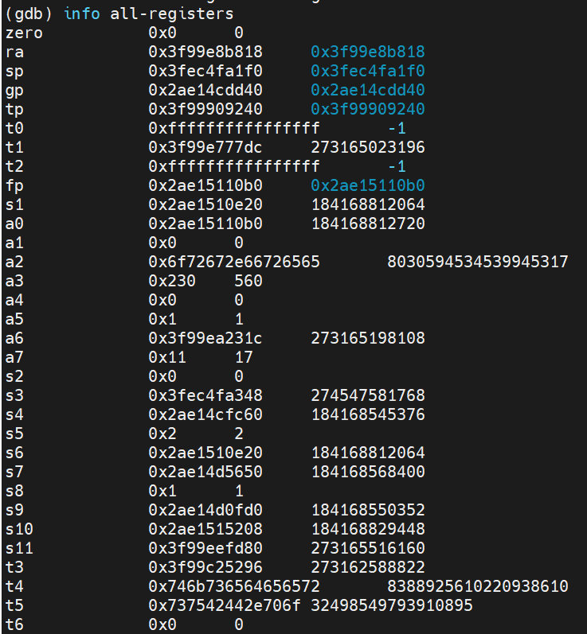
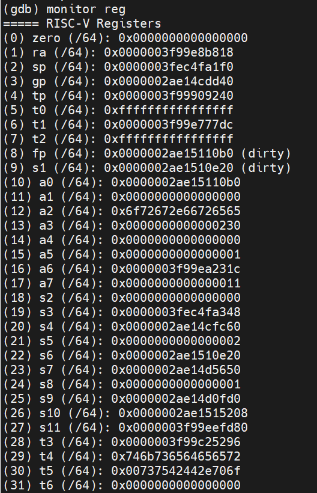

sidebar_position: 3

# JTAG Debugging Tool User Guide

## 1. Download

- **OpenOCD download**: [JTAG Debugging Tool](https://spacemit.com/community/resources-download/Tools/JTAG%20debugging%20tool)

- **GDB**:
  Included in the cross-compilation toolchain.
  Please refer to [Cross-Compilation Toolchain User Guide](https://www.spacemit.com/community/document/info?lang=en&nodepath=tools/user_guide/cross_compiler_user_guide.md)

## 2. Configure the JTAG Interface

All K1/K3-series boards include built-in JTAG debugging support.
To enable it, you need to complete **hardware setup** and **USB driver configuration**.

The steps below use **J-Link** as an example.

### 2.1 Hardware Setup

1. Open the J-Link casing and remove the jumper cap to **disable power output** from J-Link.
2. Connect the JTAG signals and check that the pins are correctly used.
   - For K1, refer to the **JTAG Debug Interface** section in the [MUSE Pi User Guide](https://www.spacemit.com/community/document/info?lang=en&nodepath=hardware/eco/k1_muse_pi/pi_user_guide.md).
   - For K3, refer to the **Development & Debugging** section in the [K3 Hardware FAQ](https://www.spacemit.com/community/document/info?lang=en&nodepath=hardware/key_stone/k3/k3_hw/k3_hw_faq.md).

### 2.2 USB Driver Setup

#### Windows

1. Download and run the **Zadig** tool from:
   [https://zadig.akeo.ie/](https://zadig.akeo.ie/)
2. In Zadig, open the **Options** menu and enable **List All Devices**.
3. Locate the **J-Link** device in the list and update its driver to **WinUSB**.
  
   

4. After successful installation, the J-Link device will appear under **Universal Serial Bus devices** in Device Manager.

> **Note**:
> If multiple drivers exist (e.g., SEGGER native driver), the OS may switch back to another driver after re-plugging the device.
> In that case, manually select **WinUSB** again from the list of available drivers.

#### Linux

1. Grant access permission for USB devices supported by OpenOCD by copying the following udev rules file into `/etc/udev/rules.d`:
   [https://github.com/riscv-collab/riscv-openocd/blob/riscv/contrib/60-openocd.rules](https://github.com/riscv-collab/riscv-openocd/blob/riscv/contrib/60-openocd.rules)
2. Reload udev rules:

```bash
udevadm control --reload
```

3. Reconnect the J-Link device to apply the new rules.

## 3. Running OpenOCD

1. Extract the downloaded OpenOCD package.
2. Using K1 X60 CPU as an example, double-click the `k1.bat` (Windows) or `k1.sh` (Linux) script in the `bin` directory to start OpenOCD.
3. To change runtime parameters, edit the startup script.
   Example (Linux):

```bash
#!/bin/bash

SCRIPT_DIR="../share/openocd/scripts"

# ADAPTER_DRIVER can set as jlink cmsis-dap ...
ADAPTER_DRIVER=jlink

./openocd -c "bindto 0.0.0.0" -c "gdb port 1024" -c "telnet port 4444" \
          -c "set SPEED 8000" \
          -c "set SECJTAG 0" \
          -c "set TARGET acpu" \
          -c "set CLUSTERS {0 1}" \
          -c "set CLUSTER0_COREIDS {0 1 2 3}" \
          -c "set CLUSTER1_COREIDS {0 1 2 3}" \
          -f $SCRIPT_DIR/interface/$ADAPTER_DRIVER.cfg \
          -f scripts/spacemit-k1.cfg
```

- `-f` loads configuration files for the J-Link adapter and the K1 target.
- `-c` sets OpenOCD options, such as:
  - `gdb port 1024` — sets the GDB debug port.
  - `TARGET` — set to `rcpu` or other values to switch the debug target between `RCPU` and `X60`.
  - `CLUSTER*` — specifies which X60 CPU clusters and cores to debug.

## 4. Debugging with GDB

Use `riscv64-unknown-linux-gnu-gdb` and connect to OpenOCD:

```bash
target remote <ip>:<port>
```

### 4.1 Debugging Using Standard GDB Commands

- Run `info threads` to check whether all 8 threads (CPU cores) are in debug mode.
  Then continue using normal GDB commands.



- Example: view registers of CPU core `k1.cpu.3`:

```bash
thread 4
info all-registers
```



### 4.2 Debugging Using OpenOCD Commands in GDB

- Use the `monitor` command inside GDB to invoke OpenOCD commands.
  For example, check whether all 8 CPU cores are in the **halted** state:

```bash
monitor targets
```

- Then continue using standard OpenOCD commands.

- Example: switch to CPU core `k1.cpu.3` and read its registers:

```bash
monitor targets 3
monitor reg
```


