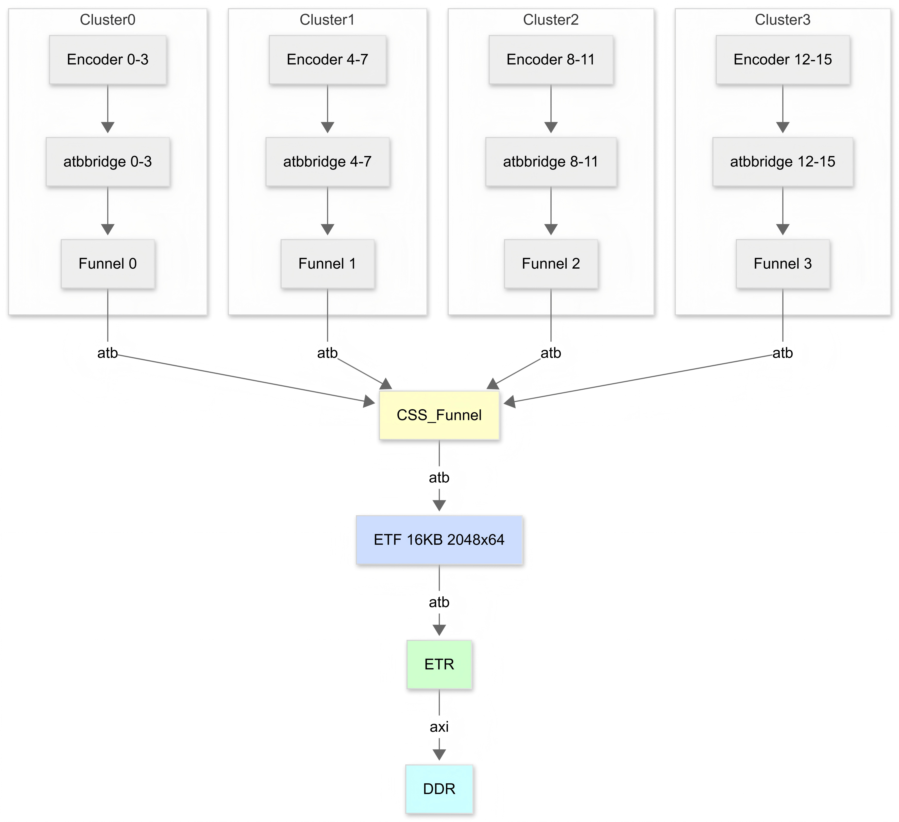

sidebar_position: 4

# Trace User Guide


## 1. Download

OpenOCD/NexRv is available for download at：[Resource Download Center](https://spacemit.com/community/resources-download/Tools/JTAG%20debugging%20tool)

GDB is included as part of the cross-compilation toolchain. For details, refer to：[Cross-Compilation Toolchain User Guide](https://www.spacemit.com/community/document/info?lang=zh&nodepath=tools/user_guide/cross_compiler_user_guide.md)

## 2. Principle

The trace hardware captures the outcome of each branch instruction during program execution and stores the resulting trace information in a dedicated memory buffer.By decoding the recorded trace data and correlating it with the information from the corresponding ELF file,the software can reconstruct the program’s PC execution path.

System Hang Analysis:

1. Before a system hang occurs, trace collection must be enabled using one of the following methods:

    - Configure the relevant trace control registers via JTAG.

    - Enable trace collection through Linux sysfs nodes.

2. After the system hangs, the trace data can be retrieved through JTAG or other available methods. By analyzing the collected trace data, the program's PC execution path can be reconstructed, providing valuable information for root cause analysis and debugging.

## 3. Operation Method



The K3 series implement trace functionality based on the  [RISC\-V N\-trace](https://github.com/riscv-non-isa/riscv-nexus-trace)protocol. The component topology is illustrated in the figure above.

The following methods are available for using trace functionality:

|Method	|Description|
|---|---|
|JTAG|Connect to the hardware JTAG port and manually configure trace enablement using the provided GDB/OpenOCD commands.<br><br>Configure triggers to automatically start or stop instruction tracing based on predefined conditions..Supported trigger conditions include:<br>1. Execution of an instruction at a specified address (breakpoint-like trigger)<br>2. Load/store access to a specified address (watchpoint-like trigger)<br>3. Execution of a single instruction<br>4. Occurrence of a specified interrupt or exception|
|sysfs|Manually enable or disable instruction tracing through sysfs nodes exposed by the Linux kernel to user space.|
|perf|Integrate with the Linux perf tool.|


Notes：

- In multi-process environments, Trace operation depends on the Linux kernel to write the scontext CSR during task scheduling.

- Trace does not record non-branch instructions,and does not capture absolute addresses for most instructions.As a result, trace analysis requires a strictly matching ELF binary for accurate decoding.

- Trace only records branch events; load/store data values are not captured. Taking the currently used N-Trace as an example, its specification currently does not support Data.

### 3.1 Using the JTAG Interface

#### 3.1.1 Configuration Instructions

Before using Trace, the corresponding Trace components must be configured, including their base addresses and operating parameters.Please refer to `tcl/spacemit/spacemit-k3-trace.cfg` .

##### 3.1.1.1 RISC-V Components

RISC-V Trace components include **Encoder** ，**ATB Bridge** and **Funnel** . Abstract entities can be created using the `rvtrace create` command：

```Bash
rvtrace create <name> <type> -target <target_name> -baseaddr <address>
rvtrace create <name> <type> -dap <dap_name*>* -ap-num <apn>
@type：encoder atbbridge funnel
```

Note：When executing the `rvtrace create` command, one of the following parameters must be specified:

- `-dap dap_name` 

- `-ap-num apn` 

- `-target target_name`（K3 only supports this method, controlling the Trace component via DM.）


Trace Encoder Configuration：The Trace Encoder control the relevant configurations defined in its supported specs. Please refer to:

```Plain Text
rvtrace create encoder0 encoder -target $_TARGETNAME.$_coreid  -baseaddr 0xd9002000
encoder0 configure ...
@-inst-mode: Instruction trace generation mode (off|resv1|resv2|btm|resv4|resv5|htm|resv7, btm(Branch Trace Messaging) and htm(History Trace Messaging), k3 support only btm)
@-context: Controls generation of Ownership messages (on|off)
@-trigger: Allows trTeInstTracing to be set or cleared by Trace-on and Traceoff signals (on|off)
@-sync-mode: Select the periodic instruction trace synchronization message/packet generation mechanism (off|messages|clock|instruction, k3 support only clock)
@-sync-max: The maximum interval between instruction trace synchronization messages/packets. Generate synchronization when count reaches 2^(sync_max+4)
@-srcid: Trace source ID assigned to this trace encoder
@-srcbits: The number of bits in the trace source field (0..12)
@-timestamp：Enable for timestamp field in trace messages/packets (on|off).
```

If `-timestamp on`is specified, the parameters of the Encoder's Timestamp subcomponent can also be configured.

```Bash
@-ts-run-debug：counter runs/stopped when hart is halted (off|on)
@-ts-mode: Mode used by Timestamp unit (none|external|system|core|shared|resv5|resv6|resv7)
@-ts-prescale: Prescale timestamp input clock
```


ATB Bridge Configuration: The `-id` parameter must be specified. Note that 0x00 and 0x70-0x7F are reserved values.

```Plain Text
@-id: ID of this node on ATB
```


Funnel Configuration: The `-ports`  parameter must be configured to enable the input ports that receive trace data from each Encoder.

```Plain Text
@-ports: control inputs
```

If  `-timestamp on` is specified, the parameters of the Funnel's Timestamp subcomponent can also be configured, similar to Encoder.

##### 3.1.1.2 Coresight Components

Coresight Trace components include **Funnel** ，**TMC** and **Timestamp** types. These components can be instantiated as logical entities using the cstrace create command.

```Bash
cstrace create <name> <type> -target <target_name> -baseaddr <address>
rvtrace create <name> <type> -dap <dap_name*>* -ap-num <apn>
@type：funnel tmc timestamp
```

Note： The following configurations are required when executing the `cstrace create` command:

- `-dap dap_name`

- `-ap-num apn` 

- `-target target_name`（K3 only supports this method, controlling the Trace component via DM.）


Funnel Configuration：The`-ports` parameter must be specified to enable input ports for receiving output data from each Cluster:

```Bash
cstrace create main_funnel funnel -target $_TARGETNAME -baseaddr 0xd9042000 -ports 0x1
# cstrace create main_funnel funnel -target $_TARGETNAME -baseaddr 0xd9042000
# main_funnel configure -ports 0x1
```


TMC Configuration：

- Includes three component types: ETB, ETF and ETR.

- The base address must be specified. The TMC type must be selected using the `-tmc-type` parameter.

- For the ETR type, the trace buffer address and size must also be configured.

```Bash
cstrace create etf tmc -target $_TARGETNAME -baseaddr 0xd9043000 -tmc-type etf
cstrace create etr tmc -target $_TARGETNAME -baseaddr 0xd9043000 -tmc-type etr
etr configure -hwaddr 0x170000000 -buf-size 0x1000000
@-tmc-type：etb etf etr
```

#### 3.1.2 Trace Control 

Before using Trace，edit the K3 script located in the `bin` directory and set `RVTRACE` and `CSTRACE` to 1 as required.After saving the configuration, double-click the script to execute it. The following log output should appear:

```Plain Text
Info : [encoder.0] type=0x1, version=0x10
Info : [encoder.0] Trace recording/protocol format: N-Trace
Info : [encoder.1] type=0x1, version=0x10
Info : [encoder.1] Trace recording/protocol format: N-Trace
Info : [encoder.2] type=0x1, version=0x10
Info : [encoder.2] Trace recording/protocol format: N-Trace
Info : [encoder.3] type=0x1, version=0x10
Info : [encoder.3] Trace recording/protocol format: N-Trace
Info : [encoder.4] type=0x1, version=0x10
Info : [encoder.4] Trace recording/protocol format: N-Trace
Info : [encoder.5] type=0x1, version=0x10
Info : [encoder.5] Trace recording/protocol format: N-Trace
Info : [encoder.6] type=0x1, version=0x10
Info : [encoder.6] Trace recording/protocol format: N-Trace
Info : [encoder.7] type=0x1, version=0x10
Info : [encoder.7] Trace recording/protocol format: N-Trace
Info : [encoder.8] type=0x1, version=0x10
Info : [encoder.8] Trace recording/protocol format: N-Trace
Info : [encoder.9] type=0x1, version=0x10
Info : [encoder.9] Trace recording/protocol format: N-Trace
Info : [encoder.10] type=0x1, version=0x10
Info : [encoder.10] Trace recording/protocol format: N-Trace
Info : [encoder.11] type=0x1, version=0x10
Info : [encoder.11] Trace recording/protocol format: N-Trace
Info : [encoder.12] type=0x1, version=0x10
Info : [encoder.12] Trace recording/protocol format: N-Trace
Info : [encoder.13] type=0x1, version=0x10
Info : [encoder.13] Trace recording/protocol format: N-Trace
Info : [encoder.14] type=0x1, version=0x10
Info : [encoder.14] Trace recording/protocol format: N-Trace
Info : [encoder.15] type=0x1, version=0x10
Info : [encoder.15] Trace recording/protocol format: N-Trace
Info : [atbbridge.0] type=0xe, version=0x10
Info : [atbbridge.1] type=0xe, version=0x10
Info : [atbbridge.2] type=0xe, version=0x10
Info : [atbbridge.3] type=0xe, version=0x10
Info : [atbbridge.4] type=0xe, version=0x10
Info : [atbbridge.5] type=0xe, version=0x10
Info : [atbbridge.6] type=0xe, version=0x10
Info : [atbbridge.7] type=0xe, version=0x10
Info : [atbbridge.8] type=0xe, version=0x10
Info : [atbbridge.9] type=0xe, version=0x10
Info : [atbbridge.10] type=0xe, version=0x10
Info : [atbbridge.11] type=0xe, version=0x10
Info : [atbbridge.12] type=0xe, version=0x10
Info : [atbbridge.13] type=0xe, version=0x10
Info : [atbbridge.14] type=0xe, version=0x10
Info : [atbbridge.15] type=0xe, version=0x10
Info : [funnel.0] type=0x8, version=0x10
Info : [funnel.1] type=0x8, version=0x10
Info : [funnel.2] type=0x8, version=0x10
Info : [funnel.3] type=0x8, version=0x10
```

When enabling Trace, each Trace component must be activated in sequence. The script provides predefined control functions for all Trace components. Users can enable the required trace path by executing the corresponding commands.

```Bash
> start_all_trace
encoder.0: Instruction trace is being generated
encoder.1: Instruction trace is being generated
encoder.2: Instruction trace is being generated
encoder.3: Instruction trace is being generated
encoder.4: Instruction trace is being generated
encoder.5: Instruction trace is being generated
encoder.6: Instruction trace is being generated
encoder.7: Instruction trace is being generated
encoder.8: Instruction trace is being generated
encoder.9: Instruction trace is being generated
encoder.10: Instruction trace is being generated
encoder.11: Instruction trace is being generated
encoder.12: Instruction trace is being generated
encoder.13: Instruction trace is being generated
encoder.14: Instruction trace is being generated
encoder.15: Instruction trace is being generated
> disable_all_trace
```

To enable trace on a single path only, run the following command:

```Plain Text
> start_trace 0
encoder.0: Instruction trace is being generated
> disable_trace 0
```

The contents of the Trace Buffer can be read from DDR using the following command:

```Bash
> dump_trace trace.bin
```

#### 3.1.3 Using Trace with Triggers

Trace start/stop control can be achieved by configuring Triggers（mcontrol/etrigger/itrigger/icount）.

For example, by configuring an mcontrol Trigger, Trace collection can be enabled when execution reaches a specified address and disabled when another address is reached.

```Bash
> enable_all_trace
> riscv mcontrol set m s u execute 0xffffffff80272738 trace_on
> riscv mcontrol set m s u execute 0xffffffff80272746 trace_off
```

#### 3.1.4 Linux S-Mode Program Trace Support

K3 now supports writing PID into scontext CSR during scheduling in multi process environments to differentiate between different processes.

Upon S-mode exit, the Trigger mechanism asserts Trace-notify and emits both a full PC packet and an Ownership packet, providing the information required for accurate trace reconstruction.

```Bash
liangzhen@snode5:~/WorkSpace2/k3-trace-sysfs$ riscv64-unknown-elf-objdump -d linux-6.12/vmlinux > vmlinux.objdump
 liangzhen@snode5:~/WorkSpace2/k3-trace-sysfs$ grep sret vmlinux.objdump
ffffffff8027963c:       10200073                sret
ffffffff80279776:       10200073                sret


Open On-Chip Debugger
> riscv mcontrol set m s u execute 0xffffffff8027963c trace_notify
> riscv mcontrol set m s u execute 0xffffffff80279776 trace_notify
```

### 3.2 Using the sysfs Interface

#### 3.2.1 Configuration

Enable the relevant `CORESIGHT` options in Linux  `menuconfig` .

```Plain Text
Location:                                                                                                                                                                                                                                                                               │
    -> Device Drivers                                                                                                                                                                                                                                                                     │
      -> HW tracing support                                                                                                                                                                                                                                                               │
        -> CoreSight Tracing Support (CORESIGHT [=y])
          -> CoreSight Link and Sink drivers (CORESIGHT_LINKS_AND_SINKS [=y])
            -> Coresight generic TMC driver (CORESIGHT_LINK_AND_SINK_TMC [=y])
          -> RISC-V Trace Support (RVTRACE [=y])
            -> RISCV Trace Encoder driver (RVTRACE_ENCODER [=y])
```

At present, K3 does not fully support `CPUILDE`. It must be disabled before Trace functionality can be used.

```Plain Text
Location: 
    -> CPU Power Management
      -> CPU Idle
        -> CPU idle PM support (CPU_IDLE [=n])
```

#### 3.2.2 Trace Control

Before starting a trace capture, the target CoreSight sink must be identified.。

```Bash
/sys/bus/coresight/devices # ls
atbbridge0  atbbridge10  atbbridge12  atbbridge14  atbbridge2  atbbridge4  atbbridge6  atbbridge8  encoder0  encoder10  encoder12  encoder14  encoder2  encoder4  encoder6  encoder8  funnel0  rvtrace_funnel1  rvtrace_funnel3  tmc_etr0 atbbridge1  atbbridge11  atbbridge13  atbbridge15  atbbridge3  atbbridge5  atbbridge7  atbbridge9  encoder1  encoder11  encoder13  encoder15  encoder3  encoder5  encoder7  encoder9  rvtrace_funnel0  rvtrace_funnel2  tmc_etf0
/sys/bus/coresight/devices # ls tmc_etr0/
buf_mode_preferred  buf_modes_available  buffer_size  connections  enable_sink  mgmt  power  stop_on_flush  subsystem  trigger_cntr  uevent  waiting_for_supplier
/sys/bus/coresight/devices #
```

ETF Buffer Modes：

- Supports flat（contiguous） and tmc-sg（scatter-gather, non-contiguous）modes.

- auto：Attempts to allocate buffer_size using either flat or tmc-sg mode.

The default buffer_size is 1MB and can be configured via the tmc_etr0/buffer_size.When the configured buffer_size exceeds 1 MB, the buffer is typically allocated using the tmc-sg mode.

```Bash
root@k3:/sys/bus/coresight/devices# cat tmc_etr0/buf_modes_available
auto flat tmc-sg
/sys/bus/coresight/devices # cat tmc_etr0/buffer_size
0x100000
/sys/bus/coresight/devices # cat tmc_etr0/buf_modes_available
auto flat tmc-sg
/sys/bus/coresight/devices # cat tmc_etr0/buf_mode_preferred
auto
/sys/bus/coresight/devices # echo 0x10000000 > tmc_etr0/buffer_size
/sys/bus/coresight/devices # cat tmc_etr0/buffer_size
0x10000000
```
There is no restriction on the number of sink or source devices that can be enabled simultaneously. As a general operation,all sink-related device classes expose an `active` attribute in sysfs.

```Bash
/sys/bus/coresight/devices # echo 1 > tmc_etr0/enable_sink
/sys/bus/coresight/devices # cat tmc_etr0/enable_sink
1
/sys/bus/coresight/devices #
```

`enable a source` to immediately triggers tracing:：

```Bash
/sys/bus/coresight/devices # echo 1 > encoder0/enable_source
[ 1132.975639] coresight encoder0: Trace encoder tracing enabled
/sys/bus/coresight/devices # cat encoder0/enable_source
1
/sys/bus/coresight/devices # 
```

Tracing stops in the same way:

```Bash
/sys/bus/coresight/devices # echo 0 > encoder0/enable_source
[ 1140.708439] coresight encoder0: Trace encoder tracing disabled
/sys/bus/coresight/devices #
```

Check if the ETR buffer is full via registers:

- The first bit of the STS register determines whether the buffer is FULL

- dba contains the base address of the trace buffer

- rsz * 4 gives the buffer size in bytes.

- rrp is the read pointer

- rwp is the write pointer

```Bash
root@k3:/sys/bus/coresight/devices# ls tmc_etr0/mgmt/
authstatus  axictl  ctl  dba  devid  ffcr  ffsr  mode  pscr  rrp  rsz  rwp  sts  trg
root@k3:/sys/bus/coresight/devices# cat tmc_etr0/mgmt/sts
0xd
root@k3:/sys/bus/coresight/devices# cat tmc_etr0/mgmt/dba
0x16c8b8000
root@k3:/sys/bus/coresight/devices# cat tmc_etr0/mgmt/rsz
0x40000
root@k3:/sys/bus/coresight/devices# cat tmc_etr0/mgmt/rrp
0x1066082b0
root@k3:/sys/bus/coresight/devices# cat tmc_etr0/mgmt/rwp
0x1066082b0
```

The contents of the ETR buffer can be read directly from `/dev`. By default, the data size exposed is 1 MB. 

```Bash
root@k3:/sys/bus/coresight/devices# dd if=/dev/tmc_etr0 of=/trace.bin
2047+2 records in
2048+0 records out
1048576 bytes (1.0 MB, 1.0 MiB) copied, 0.00694213 s, 175 MB/s
```

#### 3.2.3 Enabling Trace at Boot Time

If the system hangs during the boot process, Trace can be enabled automatically through kernel command-line parameters.

```Bash
root@k3:~# cat /boot/env_k3.txt
knl_name=vmlinuz-6.18.3-generic
ramdisk_name=initrd.img-6.18.3-generic
dtb_dir=spacemit/6.18.3-generic
ramdisk_addr=0x130000000
loglevel=8
commonargs=setenv bootargs clk_ignore_unused plymouth.prefer-fbcon plymouth.ignore-serial-consoles splash
```

1. Press `s` to enter the U-Boot.

2. Add the following parameters to the kernel cmdline：

    - `rvtrace-encoder.boot_enable=1` and `coresight-tmc.sysfs_etr_activated=1` enable the trace components automatically during boot.

    - `maxcpus=1` controls single-core boot.

```Bash
=> env print commonargs
commonargs=setenv bootargs clk_ignore_unused plymouth.prefer-fbcon plymouth.ignore-serial-consoles splash
=> env set commonargs "setenv bootargs clk_ignore_unused plymouth.prefer-fbcon plymouth.ignore-serial-consoles splash rvtrace-encoder.boot_enable=1 coresight-tmc.sysfs_etr_activated=1 maxcpus=1"
=> boot
```

If the following messages appear in the boot log, Trace has been successfully enabled.

```Plain Text
[    3.902435] trace-encoder d9002000.encoder: CPU0: Trace Encoder initialized
[    3.909424] coresight encoder0: Trace Encoder tracing enabled
```

Trace data can then be dumped via OpenOCD. The default  buffer_size is 1MB。

```Bash
#telnet localhost 4444

Open On-Chip Debugger
> rvtrace names
encoder0
atbbridge0
cluster0_funnel
> cstrace names
main_funnel
etf
etr
ts
> etr status
[k3.cpu_x100.0] Can't save register fp on a hart that is not halted.
[k3.cpu_x100.0] Can't save register fp on a hart that is not halted.
Data buffer address:   0x105737000
RAM size:              0x100000
Mode:                  0x0
Status:                0x1
RAM read ptr:          0x10571e080
RAM write ptr:         0x10571e080
Control:               0x1
Axiclt:                0xfbe
Flush status:          0x0
Flush control:         0x133
> riscv virt2phys_mode off
> riscv set_mem_access sysbus
> etr tmc dump trace.bin
A total of 256 data pages were found (total size: 1.00 MB)
dumped 1048576 bytes in 30.184010s (33.925 KiB/s)
>
```

Note：To increase the buffer-size，configure the `arm,buffer-size` property in the DTS.

```Bash
--- a/arch/riscv/boot/dts/spacemit/k3-trace.dtsi
+++ b/arch/riscv/boot/dts/spacemit/k3-trace.dtsi
@@ -791,6 +791,7 @@ etr: etr@d9044000 {
                        clocks = <&dummy_clk>;
                        clock-names = "apb_pclk";
                        arm,scatter-gather;
+                       arm,buffer-size = <0x400000>;
                        in-ports {
                                port {
                                        etr_in_port: endpoint {

```


### 3.3 Using the perf Tool

#### 3.3.1 Configuration

Same as [3.2.1](#321-configuration) 

#### 3.3.2 Display rvtrace pmu - perf list

```Bash
root@k3:~# perf list pmu

List of pre-defined events (to be used in -e or -M):

  rvtrace//                                          [Kernel PMU event]

```

#### 3.3.3 Trace Data Collection - perf record

Since a trace source can be connected to multiple receivers, the receiver that is actively receiving trace data must first be identified. This receiver must then be explicitly specified as an option in the perf command line.Once the target receivers has been identified, trace collection can be started.

```Bash
root@k3:~# rm -rf ~/.debug
root@k3:~# perf record -e rvtrace/@tmc_etr0/ --per-thread uname
Linux
[ perf record: Woken up 1 times to write data ]
[ perf record: Captured and wrote 3.047 MB perf.data ]

```

#### 3.3.4 Trace Decoding - perf report

This command is used to analyze performance data previously collected with `perf record` .

```Bash
root@k3:~# perf report --stdio
# To display the perf.data header info, please use --header/--header-only options.
#
RISC-V Trace: A FIFO overrun has resulted in the loss of one or more messages
RISC-V Trace: A FIFO overrun has resulted in the loss of one or more messages
...
#
# Total Lost Samples: 0
#
# Samples: 400K of event 'branches'
# Event count (approx.): 400355
#
# Children      Self  Command  Shared Object                Symbol
# ........  ........  .......  ...........................  ...........................................
#
    10.78%    10.78%  uname    ld-linux-riscv64-lp64d.so.1  [.] _dl_relocate_object_no_relro
     3.32%     3.32%  uname    libc.so.6                    [.] __memcpy_noalignment
     3.28%     3.28%  uname    [kernel.kallsyms]            [k] memcpy
     2.93%     2.93%  uname    [kernel.kallsyms]            [k] __rcu_read_unlock
     2.72%     2.72%  uname    ld-linux-riscv64-lp64d.so.1  [.] do_lookup_x
     2.45%     2.45%  uname    [kernel.kallsyms]            [k] __handle_mm_fault
     2.34%     2.34%  uname    [kernel.kallsyms]            [k] filemap_map_pages
     2.09%     2.09%  uname    [kernel.kallsyms]            [k] set_pte_range
     1.99%     1.99%  uname    [kernel.kallsyms]            [k] mod_memcg_lruvec_state
     1.99%     1.99%  uname    [kernel.kallsyms]            [k] __rcu_read_lock
     1.79%     1.79%  uname    [kernel.kallsyms]            [k] mas_walk
     1.56%     1.56%  uname    [kernel.kallsyms]            [k] next_uptodate_folio
     1.33%     1.33%  uname    [kernel.kallsyms]            [k] folio_add_file_rmap_ptes
     1.32%     1.32%  uname    [kernel.kallsyms]            [k] __lruvec_stat_mod_folio
     1.24%     1.24%  uname    [kernel.kallsyms]            [k] __kprobes_text_start
     1.08%     1.08%  uname    [kernel.kallsyms]            [k] memset
     1.03%     1.03%  uname    [kernel.kallsyms]            [k] get_page_from_freelist
     1.02%     1.02%  uname    [kernel.kallsyms]            [k] finish_fault
     0.98%     0.98%  uname    [kernel.kallsyms]            [k] flush_icache_pte
     0.96%     0.96%  uname    ld-linux-riscv64-lp64d.so.1  [.] _dl_lookup_symbol_x
...
```

During analysis, an additional trace dump file is generated, containing the received trace packets.This file is stored in the ` \~/\.debug ` directory in the form of  `trace\.bin`  (Nexus format).

```Bash
root@k3:~# perf report --dump > uname.dump

...
0 0x1400 [0x30]: PERF_RECORD_AUXTRACE size: 0x30ab50  offset: 0  ref: 0  idx: 0  tid: 1717  cpu: -1
.
. ... Trace Encoder Trace data: size 0x30ab50 bytes
MSG #0 +0 - ProgTraceSync TCODE[6]=9 SRC[12]=0x5 SYNC[4]=0x5 ICNT[2]=0x0 FADDR[66]=0xffffffffc05b1f1a TSTAMP[36]=0x32fb1f870
MSG #1 +21 - Ownership TCODE[6]=2 SRC[12]=0x5 FORMAT[2]=0x3 PRV[2]=0x1 V[1]=0x0 CONTEXT[1]=0x0 TSTAMP[6]=0x0
MSG #2 +26 - Ownership TCODE[6]=2 SRC[12]=0x5 FORMAT[2]=0x2 PRV[2]=0x1 V[1]=0x0 CONTEXT[13]=0x6b5 TSTAMP[6]=0x0
MSG #3 +33 - IDLE
MSG #4 +34 - IndirectBranch TCODE[6]=4 SRC[12]=0x5 BTYPE[2]=0x0 ICNT[10]=0x16 UADDR[18]=0x35c5 TSTAMP[6]=0x3
MSG #5 +43 - IndirectBranch TCODE[6]=4 SRC[12]=0x5 BTYPE[2]=0x0 ICNT[10]=0x17 UADDR[12]=0x4c7 TSTAMP[6]=0x0
MSG #6 +51 - IndirectBranch TCODE[6]=4 SRC[12]=0x5 BTYPE[2]=0x0 ICNT[4]=0xe UADDR[18]=0x1e78f TSTAMP[6]=0x0
MSG #7 +59 - DirectBranch TCODE[6]=3 SRC[12]=0x5 ICNT[6]=0x10 TSTAMP[6]=0x1
MSG #8 +64 - IndirectBranch TCODE[6]=4 SRC[12]=0x5 BTYPE[2]=0x0 ICNT[10]=0x27 UADDR[12]=0x5e TSTAMP[6]=0x0
MSG #9 +72 - IndirectBranch TCODE[6]=4 SRC[12]=0x5 BTYPE[2]=0x0 ICNT[4]=0xf UADDR[24]=0x4a0615 TSTAMP[6]=0x5
MSG #10 +81 - IndirectBranch TCODE[6]=4 SRC[12]=0x5 BTYPE[2]=0x0 ICNT[10]=0x25 UADDR[24]=0x64fb12 TSTAMP[6]=0x0
MSG #11 +91 - DirectBranch TCODE[6]=3 SRC[12]=0x5 ICNT[6]=0x9 TSTAMP[6]=0x0
MSG #12 +96 - DirectBranch TCODE[6]=3 SRC[12]=0x5 ICNT[6]=0x12 TSTAMP[6]=0x1
MSG #13 +101 - DirectBranch TCODE[6]=3 SRC[12]=0x5 ICNT[12]=0x46 TSTAMP[6]=0x0
MSG #14 +107 - IndirectBranch TCODE[6]=4 SRC[12]=0x5 BTYPE[2]=0x0 ICNT[4]=0x1 UADDR[24]=0x64e4cf TSTAMP[6]=0x0
MSG #15 +116 - DirectBranch TCODE[6]=3 SRC[12]=0x5 ICNT[6]=0x3 TSTAMP[6]=0x0
...
MSG #432340 +2935803 - ProgTraceSync TCODE[6]=9 SRC[12]=0x5 SYNC[4]=0x2 ICNT[8]=0xb FADDR[66]=0xffffffffc05b2954 TSTAMP[36]=0x32fb37eb9
MSG #432341 +2935825 - Ownership TCODE[6]=2 SRC[12]=0x5 FORMAT[2]=0x3 PRV[2]=0x1 V[1]=0x0 CONTEXT[1]=0x0 TSTAMP[6]=0x0
MSG #432342 +2935830 - Ownership TCODE[6]=2 SRC[12]=0x5 FORMAT[2]=0x2 PRV[2]=0x1 V[1]=0x0 CONTEXT[13]=0x6b5 TSTAMP[6]=0x0
MSG #432343 +2935837 - DirectBranch TCODE[6]=3 SRC[12]=0x5 ICNT[6]=0xc TSTAMP[6]=0x3
MSG #432344 +2935842 - ProgTraceCorrelation TCODE[6]=33 SRC[12]=0x5 EVCODE[4]=0x4 CDF[2]=0x0 ICNT[6]=0x11 TSTAMP[6]=0x4
MSG #432345 +2935848 - IDLE

Stat: 2935849 bytes, 5042 idles, 432346 messages, 2585 error messages, 0 invalid messages6.79 bytes/message
```

```YAML
root@k3:~# tree -L6 .debug/
.debug/
├── trace.bin
├── usr
│   └── lib
│       ├── cargo
│       │   └── bin
│       │       └── coreutils
│       │           └── uname
│       ├── modules
│       │   └── 6.18.3-generic
│       │       └── kernel
│       │           ├── crypto
│       │           ├── drivers
│       │           ├── fs
│       │           └── net
│       └── riscv64-linux-gnu
│           ├── ld-linux-riscv64-lp64d.so.1
│           │   └── d2f64ebe99ddd9b21c954676ea8c0d3782873f72
│           │       ├── elf
│           │       └── probes
│           ├── libc.so.6
│           │   └── fb5bd55cf11bf0e11b5f59470ff7f0120f96e4de
│           │       ├── elf
│           │       └── probes
│           ├── libgcc_s.so.1
│           │   └── 98e0b48dab10fba41787aad71d770bd2a851ac1b
│           │       ├── elf
│           │       └── probes
│           ├── libm.so.6
│           │   └── 1c11f88d49341bf08cd3a2d9c84bfd3edd19b9b5
│           │       ├── elf
│           │       └── probes
│           ├── libpcre2-8.so.0.14.0
│           │   └── b84e2ac2a793121160ac29cae3d255d5b5f7116e
│           │       ├── elf
│           │       └── probes
│           └── libselinux.so.1
│               └── 0fab3faf7fad97c972e95b19d89be241865caa72
│                   ├── elf
│                   └── probes
└── [vdso]
    └── c0e667f1e4f837863f332fef7d2e6eef6194b673
        ├── probes
        └── vdso

```

Note: A total of 2,585 error messages were reported in this case, indicating that the internal trace FIFO overflowed. As a result, some trace data was lost.

```Bash
Stat: 2935849 bytes, 5042 idles, 432346 messages, 2585 error messages, 0 invalid messages6.79 bytes/message
```

#### 3.3.5  PC Trace Decoding - perf script

This command decodes trace packets into perf samples in the following format:  `[application] [pid] [cpu] [cycles] [branches:] [source address] [symbol] => [destination address] [symbol]` 


```Bash
root@k3:~# perf script
           uname    1717 [005]          1           branches:  ffffffff80b63e34 rvtrace_poll_bit+0x38 ([kernel.kallsyms]) => ffffffff80b63e5e rvtrace_poll_bit+0x62 ([kernel.kallsyms])
           uname    1717 [005]          1           branches:  ffffffff80b655be encoder_enable_hw+0x23e ([kernel.kallsyms]) => ffffffff80b655ea encoder_enable_hw+0x26a ([kernel.kallsyms])
           uname    1717 [005]          1           branches:  ffffffff80b65c30 encoder_enable+0x84 ([kernel.kallsyms]) => ffffffff80b65c4a encoder_enable+0x9e ([kernel.kallsyms])
           uname    1717 [005]          1           branches:  ffffffff80b5932e etm_event_start+0x18e ([kernel.kallsyms]) => ffffffff80b5934c etm_event_start+0x1ac ([kernel.kallsyms])
           uname    1717 [005]          1           branches:  ffffffff80b5935e etm_event_start+0x1be ([kernel.kallsyms]) => ffffffff80b583b4 coresight_get_sink_id+0x18 ([kernel.kallsyms])
           uname    1717 [005]          1           branches:  ffffffff80b59392 etm_event_start+0x1f2 ([kernel.kallsyms]) => ffffffff80b593ac etm_event_start+0x20c ([kernel.kallsyms])
           uname    1717 [005]          1           branches:  ffffffff80219fb8 perf_report_aux_output_id+0x0 ([kernel.kallsyms]) => ffffffff80219ffe perf_report_aux_output_id+0x46 ([kernel.kallsyms])
           uname    1717 [005]          1           branches:  ffffffff80e8699c memset+0x0 ([kernel.kallsyms]) => ffffffff80e869aa memset+0xe ([kernel.kallsyms])
           uname    1717 [005]          1           branches:  ffffffff80e869be memset+0x22 ([kernel.kallsyms]) => ffffffff80e869e0 memset+0x44 ([kernel.kallsyms])
           uname    1717 [005]          1           branches:  ffffffff80e869fc memset+0x60 ([kernel.kallsyms]) => ffffffff80e86a86 memset+0xea ([kernel.kallsyms])
           uname    1717 [005]          1           branches:  ffffffff80e86a96 memset+0xfa ([kernel.kallsyms]) => ffffffff80e86a96 memset+0xfa ([kernel.kallsyms])
           uname    1717 [005]          1           branches:  ffffffff8021a002 perf_report_aux_output_id+0x4a ([kernel.kallsyms]) => ffffffff8021a006 perf_report_aux_output_id+0x4e ([kernel.kallsyms])
           uname    1717 [005]          1           branches:  ffffffff8021a0a6 perf_report_aux_output_id+0xee ([kernel.kallsyms]) => ffffffff8021a020 perf_report_aux_output_id+0x68 ([kernel.kallsyms])
           uname    1717 [005]          1           branches:  ffffffff8021a08c perf_report_aux_output_id+0xd4 ([kernel.kallsyms]) => ffffffff80219ee0 __perf_event_header__init_id+0x28 ([kernel.kallsyms])
           uname    1717 [005]          1           branches:  ffffffff80219f44 __perf_event_header__init_id+0x8c ([kernel.kallsyms]) => ffffffff80219f4c __perf_event_header__init_id+0x94 ([kernel.kallsyms])
           uname    1717 [005]          1           branches:  ffffffff80219fb2 __perf_event_header__init_id+0xfa ([kernel.kallsyms]) => ffffffff80219f5c __perf_event_header__init_id+0xa4 ([kernel.kallsyms])
...
```

#### 3.3.6 Decoding OpenSBI Trace Data

OpenSBI, as a RISC-V Linux firmware running in M ​​mode, cannot directly access its data in M/S/U modes and therefore cannot be directly parsed.It requires passing the OpenSBI ELF file via the options `-m, --machine-code <file>`  and `--machine-code-base <address>` to assist in parsing.


```Bash
perf script -m ./fw_dynamic.elf --machine-code-base 0x100000000
```

#### 3.3.7 Locating Unknown Symbols

When a symbol is reported as [unknown] and its exact location cannot be determined directly, use the following procedure to identify the corresponding instruction address:

1. Execute the following command to display mmap events

2. Locate the mmap entry corresponding to the target library in the output. This provides the base address and mapping length of the library in memory.

3. Use the reported offset together with the library's disassembly output to calculate and locate the exact instruction corresponding to the unknown symbol.

```Bash
root@k3:~# perf script --show-mmap-events
         swapper       0 [000] PERF_RECORD_MMAP2 -1/0: [0xffffffff80002000(0x202f200) @ 0xffffffff80002000 <e105f084d1daa7151a564fb637f559358d56e2ec>]: ---p [kernel.kallsyms]_text
         swapper       0 [000] PERF_RECORD_MMAP2 -1/0: [0xffffffff020bc000(0x6a000) @ 0 <3c40a19014370e5c7cb6f74b5930722e65f936be>]: ---p [autofs4]
         swapper       0 [000] PERF_RECORD_MMAP2 -1/0: [0xffffffff0212a000(0x1d000) @ 0 <3c40a19014370e5c7cb6f74b5930722e65f936be>]: ---p [nfnetlink]
         swapper       0 [000] PERF_RECORD_MMAP2 -1/0: [0xffffffff0214a000(0x2d000) @ 0 <3c40a19014370e5c7cb6f74b5930722e65f936be>]: ---p [sch_fq_codel]
         swapper       0 [000] PERF_RECORD_MMAP2 -1/0: [0xffffffff0217a000(0x236000) @ 0 <3c40a19014370e5c7cb6f74b5930722e65f936be>]: ---p [r8127]
         swapper       0 [000] PERF_RECORD_MMAP2 -1/0: [0xffffffff80002000(0x202f200) @ 0xffffffff80002000 <e105f084d1daa7151a564fb637f559358d56e2ec>]: ---p [kernel.kallsyms]_text
         swapper       0 [000] PERF_RECORD_MMAP2 -1/0: [0xffffffff020bc000(0x6a000) @ 0 <3c40a19014370e5c7cb6f74b5930722e65f936be>]: ---p [autofs4]
         swapper       0 [000] PERF_RECORD_MMAP2 -1/0: [0xffffffff0212a000(0x1d000) @ 0 <3c40a19014370e5c7cb6f74b5930722e65f936be>]: ---p [nfnetlink]
         swapper       0 [000] PERF_RECORD_MMAP2 -1/0: [0xffffffff0214a000(0x2d000) @ 0 <3c40a19014370e5c7cb6f74b5930722e65f936be>]: ---p [sch_fq_codel]
         swapper       0 [000] PERF_RECORD_MMAP2 -1/0: [0xffffffff0217a000(0x236000) @ 0 <3c40a19014370e5c7cb6f74b5930722e65f936be>]: ---p [r8127]
         swapper       0 [000] PERF_RECORD_MMAP2 -1/0: [0xffffffff023b3000(0x89000) @ 0 <3c40a19014370e5c7cb6f74b5930722e65f936be>]: ---p [bluetooth]
         swapper       0 [000] PERF_RECORD_MMAP2 -1/0: [0xffffffff0243c000(0x25000) @ 0 <3c40a19014370e5c7cb6f74b5930722e65f936be>]: ---p [btrtl]
         swapper       0 [000] PERF_RECORD_MMAP2 -1/0: [0xffffffff02465000(0x8000) @ 0 <3c40a19014370e5c7cb6f74b5930722e65f936be>]: ---p [af_alg]
         swapper       0 [000] PERF_RECORD_MMAP2 -1/0: [0xffffffff0246d000(0x2000) @ 0 <3c40a19014370e5c7cb6f74b5930722e65f936be>]: ---p [algif_hash]
         swapper       0 [000] PERF_RECORD_MMAP2 -1/0: [0xffffffff0246f000(0xd000) @ 0 <3c40a19014370e5c7cb6f74b5930722e65f936be>]: ---p [algif_skcipher]
         swapper       0 [000] PERF_RECORD_MMAP2 -1/0: [0xffffffff0247f000(0x6000) @ 0 <3c40a19014370e5c7cb6f74b5930722e65f936be>]: ---p [cmac]
         swapper       0 [000] PERF_RECORD_MMAP2 -1/0: [0xffffffff02485000(0x17000) @ 0 <3c40a19014370e5c7cb6f74b5930722e65f936be>]: ---p [btbcm]
         swapper       0 [000] PERF_RECORD_MMAP2 -1/0: [0xffffffff024af000(0x5000) @ 0 <3c40a19014370e5c7cb6f74b5930722e65f936be>]: ---p [qrtr]
         swapper       0 [000] PERF_RECORD_MMAP2 -1/0: [0xffffffff024b4000(0x59000) @ 0 <3c40a19014370e5c7cb6f74b5930722e65f936be>]: ---p [btintel]
         swapper       0 [000] PERF_RECORD_MMAP2 -1/0: [0xffffffff02554000(0xa000) @ 0 <3c40a19014370e5c7cb6f74b5930722e65f936be>]: ---p [rfcomm]
         swapper       0 [000] PERF_RECORD_MMAP2 -1/0: [0xffffffff0255e000(0x23000) @ 0 <3c40a19014370e5c7cb6f74b5930722e65f936be>]: ---p [binfmt_misc]
         swapper       0 [000] PERF_RECORD_MMAP2 -1/0: [0xffffffff025a5000(0x10000) @ 0 <3c40a19014370e5c7cb6f74b5930722e65f936be>]: ---p [btusb]
         swapper       0 [000] PERF_RECORD_MMAP2 -1/0: [0xffffffff025b5000(0x1a000) @ 0 <3c40a19014370e5c7cb6f74b5930722e65f936be>]: ---p [fusb301]
         swapper       0 [000] PERF_RECORD_MMAP2 -1/0: [0xffffffff025d3000(0x3e000) @ 0 <3c40a19014370e5c7cb6f74b5930722e65f936be>]: ---p [ecc]
         swapper       0 [000] PERF_RECORD_MMAP2 -1/0: [0xffffffff0264c000(0x8000) @ 0 <3c40a19014370e5c7cb6f74b5930722e65f936be>]: ---p [ecdh_generic]
           uname    1717 [-01] 18446744073.709551: PERF_RECORD_MMAP2 1717/1717: [0x2ac05e4000(0xbb3000) @ 0 <0a01c51fa68e0691edbc42433b63fd94f9a7755f>]: r-xp /usr/lib/cargo/bin/coreutils/uname
           uname    1717 [-01] 18446744073.709551: PERF_RECORD_MMAP2 1717/1717: [0x3fa1364000(0x28000) @ 0 <9540ac7413d6c4228cd17cc6134de3e6fb9beb21>]: r-xp /usr/lib/riscv64-linux-gnu/ld-linux-riscv64-lp64d.so.1
           uname    1717 [-01] 18446744073.709551: PERF_RECORD_MMAP2 1717/1717: [0x3fa1362000(0x2000) @ 0 00:00 0 0]: r-xp [vdso]
           uname    1717 [-01] 18446744073.709551: PERF_RECORD_MMAP2 1717/1717: [0x3fa1316000(0x30000) @ 0 <46fa1ca53802f55e5898049e55e9f4e7f54a79c4>]: r-xp /usr/lib/riscv64-linux-gnu/libselinux.so.1
           uname    1717 [-01] 18446744073.709551: PERF_RECORD_MMAP2 1717/1717: [0x3fa12f8000(0x1e000) @ 0 <50e2f95b4ae58f92537f1f96eb580a6f9ac037e6>]: r-xp /usr/lib/riscv64-linux-gnu/libgcc_s.so.1
           uname    1717 [-01] 18446744073.709551: PERF_RECORD_MMAP2 1717/1717: [0x3fa126c000(0x8c000) @ 0 <d7ccb5139173e6921a52c58d256f6c596719cdfb>]: r-xp /usr/lib/riscv64-linux-gnu/libm.so.6
           uname    1717 [-01] 18446744073.709551: PERF_RECORD_MMAP2 1717/1717: [0x3fa10e3000(0x189000) @ 0 <e0967156e0610a957dc33f7c218bf35564a9da9d>]: r-xp /usr/lib/riscv64-linux-gnu/libc.so.6
           uname    1717 [-01] 18446744073.709551: PERF_RECORD_MMAP2 1717/1717: [0x3fa1052000(0x91000) @ 0 <24e486346580a9a60d4d26962f09a224103085dd>]: r-xp /usr/lib/riscv64-linux-gnu/libpcre2-8.so.0.14.0
...
```

- In some cases, symbols in certain shared libraries cannot be found.

   Using libselinux\.so\.1 as an example:

  ```TypeScript
  uname    1294 [007]          1           branches:        3fad058edc [unknown] (/usr/lib/riscv64-linux-gnu/libselinux.so.1) =>       3fad058e7e [unknown] (/usr/lib/riscv64-linux-gnu/libselinux.so.1)
           uname    1294 [007]          1           branches:        3fad058e80 [unknown] (/usr/lib/riscv64-linux-gnu/libselinux.so.1) =>       3fad058e82 [unknown] (/usr/lib/riscv64-linux-gnu/libselinux.so.1)
           uname    1294 [007]          1           branches:        3fad058e96 [unknown] (/usr/lib/riscv64-linux-gnu/libselinux.so.1) =>       3fad058e9c [unknown] (/usr/lib/riscv64-linux-gnu/libselinux.so.1)
           uname    1294 [007]          1           branches:        3fad0a5218 call_init+0x8a (/usr/lib/riscv64-linux-gnu/ld-linux-riscv64-lp64d.so.1) =>       3fad0a521a call_init+0x8c (/usr/lib/riscv64-linux-gnu/ld-linux-riscv64-lp64d.so.1)
           uname    1294 [007]          1           branches:        3fad0a520c call_init+0x7e (/usr/lib/riscv64-linux-gnu/ld-linux-riscv64-lp64d.so.1) =>       3fad0a5216 call_init+0x88 (/usr/lib/riscv64-linux-gnu/ld-linux-riscv64-lp64d.so.1)

  ```

  - The mmap base address and mapping size for libselinux.so.1 are `0x3fad052000(0x31000)`

  - The offset of 3fad058e7e [unknown] is calculated as `6e7e`

  - Examining the symbol address of libselinux.so.1 shows that offset 6e7e does not fall within the address range of any exported or recognized symbol. Therefore, perf cannot associate this address with a known symbol and displays it as [unknown]

  ```Bash
  root@k3:~# nm -D /usr/lib/riscv64-linux-gnu/libselinux.so.1 | head -20
                   U abort@GLIBC_2.27
                   U access@GLIBC_2.27
                   U alphasort64@GLIBC_2.27
                   U __asprintf_chk@GLIBC_2.27
                   U __assert_fail@GLIBC_2.27
  0000000000008cd4 T avc_add_callback@@LIBSELINUX_1.0
  00000000000083de T avc_audit@@LIBSELINUX_1.0
  0000000000008054 T avc_av_stats@@LIBSELINUX_1.0
  0000000000007f0c T avc_cache_stats@@LIBSELINUX_1.0
  0000000000008172 T avc_cleanup@@LIBSELINUX_1.0
  0000000000008ac8 T avc_compute_create@@LIBSELINUX_1.0
  0000000000008bf2 T avc_compute_member@@LIBSELINUX_1.0
  0000000000007ca8 T avc_context_to_sid@@LIBSELINUX_1.0
  0000000000007c1e T avc_context_to_sid_raw@@LIBSELINUX_1.0
  00000000000082a4 T avc_destroy@@LIBSELINUX_1.0
  0000000000007dfa T avc_get_initial_sid@@LIBSELINUX_1.0
  0000000000008a3a T avc_has_perm@@LIBSELINUX_1.0
  0000000000008838 T avc_has_perm_noaudit@@LIBSELINUX_1.0
  0000000000007ee6 T avc_init@@LIBSELINUX_1.0
  0000000000009a92 T avc_netlink_acquire_fd@@LIBSELINUX_1.0
  ```

- Some addresses in uname cannot be resolved to symbols.

  ```TypeScript
   uname    1294 [007]          1           branches:        2ae048ca72 main+0xc (/usr/lib/cargo/bin/coreutils/uname) =>       2ae048ca8a main+0x24 (/usr/lib/cargo/bin/coreutils/uname)
             uname    1294 [007]          1           branches:        2ae048d070     [unknown] (/usr/lib/cargo/bin/coreutils/uname) =>       2ae048d092   [unknown] (/usr/lib/cargo/bin/coreutils/uname)
  ```

  The offset of 2ae048d070 `[unknown]` is calculated as `1b070` , which still falls within the main region.However, the symbol table reports the size of main as only 48 bytes, which does not match the actual code range. This is a common issue in binaries compiled with Rust. 

  ```Bash
  root@k3:~# readelf -s /usr/lib/cargo/bin/coreutils/uname | grep main
     671: 00000000001b6a66    48 FUNC    GLOBAL DEFAULT   11 main
  ```

#### 3.3.8 A Simple Example of Multi-Process

```Bash
root@k3:~# cat test_fork.c
#include <stdio.h>
#include <stdlib.h>
#include <unistd.h>
#include <sys/types.h>
#include <sys/wait.h>
#include <sched.h>

// Child Process Workload
void child_task() {
    printf("Child process: Running on CPU=%d PID=%d\n", sched_getcpu(), getpid());
    sleep(1);  // Simulated task execution
    printf("Child process: Task finished\n");
}


int main() {
    pid_t pid;

    // Create a Child Process
    pid = fork();

    if (pid == -1) {
        // fork Failure
        perror("fork failed");
        exit(1);
    } else if (pid == 0) {
        // Child Process
        child_task();
        exit(0);  // Execute the assigned task and exit upon completion
    } else {
        // Parent Process
        printf("Parent process: Waiting for child to finish...\n");
        wait(NULL);  // Wait for the child process to terminate
        printf("Parent process: Child finished\n");
    }

    return 0;
}

root@k3:~# gcc -D_GNU_SOURCE test_fork.c -o test_fork
root@k3:~# perf record -e rvtrace/@tmc_etr0/ ./test_fork
Parent process: Waiting for child to finish...
Child process: Running on CPU=5 PID=2121
Child process: Task finished
Parent process: Child finished
[ perf record: Woken up 1 times to write data ]
[ perf record: Captured and wrote 0.628 MB perf.data ]
root@k3:~# perf script > test_fork.log
root@k3:~# grep "\/root\/test_fork" test_fork.log -nrI
41715:       test_fork    2120 [001]   103.804604:          1           branches:        2ac8c88812 load_gp+0x0 (/root/test_fork) =>       2ac8c8881a load_gp+0x8 (/root/test_fork)
41749:       test_fork    2120 [001]   103.804604:          1           branches:        2ac8c887f0 _start+0x0 (/root/test_fork) =>       2ac8c8881a load_gp+0x8 (/root/test_fork)
41750:       test_fork    2120 [001]   103.804604:          1           branches:        2ac8c887f4 _start+0x4 (/root/test_fork) =>       2ac8c88768 __libc_start_main@plt+0x8 (/root/test_fork)
41758:       test_fork    2120 [001]   103.804604:          1           branches:        2ac8c888d2 frame_dummy+0x0 (/root/test_fork) =>       2ac8c88878 register_tm_clones+0x24 (/root/test_fork)
41759:       test_fork    2120 [001]   103.804604:          1           branches:        2ac8c8888c register_tm_clones+0x38 (/root/test_fork) =>       2ac8c88892 register_tm_clones+0x3e (/root/test_fork)
41765:       test_fork    2120 [001]   103.804604:          1           branches:        2ac8c8892a main+0x0 (/root/test_fork) =>       2ac8c88788 fork@plt+0x8 (/root/test_fork)
59213:       test_fork    2120 [001]   103.804610:          1           branches:        2ac8c88936 main+0xc (/root/test_fork) =>       2ac8c88936 main+0xc (/root/test_fork)
59509:       test_fork    2120 [001]   103.804610:          1           branches:        2ac8c88938 main+0xe (/root/test_fork) =>       2ac8c8893c main+0x12 (/root/test_fork)
59510:       test_fork    2120 [001]   103.804610:          1           branches:        2ac8c88940 main+0x16 (/root/test_fork) =>       2ac8c88946 main+0x1c (/root/test_fork)
59511:       test_fork    2120 [001]   103.804610:          1           branches:        2ac8c8895c main+0x32 (/root/test_fork) =>       2ac8c88962 main+0x38 (/root/test_fork)
59512:       test_fork    2120 [001]   103.804610:          1           branches:        2ac8c8896e main+0x44 (/root/test_fork) =>       2ac8c88798 puts@plt+0x8 (/root/test_fork)
65513:       test_fork    2120 [001]   103.804611:          1           branches:        2ac8c8897a main+0x50 (/root/test_fork) =>       2ac8c88758 wait@plt+0x8 (/root/test_fork)
68282:       test_fork    2121 [005]   103.804612:          1           branches:        2ac8c88936 main+0xc (/root/test_fork) =>       2ac8c88946 main+0x1c (/root/test_fork)
68283:       test_fork    2121 [005]   103.804612:          1           branches:        2ac8c8895c main+0x32 (/root/test_fork) =>       2ac8c88770 sched_getcpu@plt+0x0 (/root/test_fork)
68376:       test_fork    2121 [005]   103.804612:          1           branches:        2ac8c88774 sched_getcpu@plt+0x4 (/root/test_fork) =>       2ac8c88774 sched_getcpu@plt+0x4 (/root/test_fork)
68377:       test_fork    2121 [005]   103.804612:          1           branches:        2ac8c88778 sched_getcpu@plt+0x8 (/root/test_fork) =>       2ac8c88778 sched_getcpu@plt+0x8 (/root/test_fork)
68931:       test_fork    2121 [005]   103.804612:          1           branches:        2ac8c888f0 child_task+0xe (/root/test_fork) =>       2ac8c887a8 getpid@plt+0x8 (/root/test_fork)
68958:       test_fork    2121 [005]   103.804612:          1           branches:        2ac8c888f8 child_task+0x16 (/root/test_fork) =>       2ac8c887e8 printf@plt+0x8 (/root/test_fork)
75290:       test_fork    2121 [005]   103.804614:          1           branches:        2ac8c8890a child_task+0x28 (/root/test_fork) =>       2ac8c8890c child_task+0x2a (/root/test_fork)
75291:       test_fork    2121 [005]   103.804614:          1           branches:        2ac8c887d0 sleep@plt+0x0 (/root/test_fork) =>       2ac8c887d8 sleep@plt+0x8 (/root/test_fork)
75930:       test_fork    2121 [005]   103.828616:          1           branches:        2ac8c88910 child_task+0x2e (/root/test_fork) =>       2ac8c88798 puts@plt+0x8 (/root/test_fork)
76471:       test_fork    2121 [005]   103.828617:          1           branches:        2ac8c8891c child_task+0x3a (/root/test_fork) =>       2ac8c88928 child_task+0x46 (/root/test_fork)
76472:       test_fork    2121 [005]   103.828617:          1           branches:        2ac8c88968 main+0x3e (/root/test_fork) =>       2ac8c887c8 exit@plt+0x8 (/root/test_fork)
77486:       test_fork    2121 [005]   103.828617:          1           branches:        2ac8c88894 __do_global_dtors_aux+0x0 (/root/test_fork) =>       2ac8c88894 __do_global_dtors_aux+0x0 (/root/test_fork)
77582:       test_fork    2121 [005]   103.828617:          1           branches:        2ac8c88898 __do_global_dtors_aux+0x4 (/root/test_fork) =>       2ac8c888b8 __do_global_dtors_aux+0x24 (/root/test_fork)
77589:       test_fork    2121 [005]   103.828617:          1           branches:        2ac8c888ba __do_global_dtors_aux+0x26 (/root/test_fork) =>       2ac8c88836 deregister_tm_clones+0x18 (/root/test_fork)
77590:       test_fork    2121 [005]   103.828617:          1           branches:        2ac8c8884c deregister_tm_clones+0x2e (/root/test_fork) =>       2ac8c88852 deregister_tm_clones+0x34 (/root/test_fork)
77591:       test_fork    2121 [005]   103.828617:          1           branches:        2ac8c888be __do_global_dtors_aux+0x2a (/root/test_fork) =>       2ac8c888c4 __do_global_dtors_aux+0x30 (/root/test_fork)
77884:       test_fork    2121 [005]   103.828617:          1           branches:        2ac8c888c8 __do_global_dtors_aux+0x34 (/root/test_fork) =>       2ac8c888ce __do_global_dtors_aux+0x3a (/root/test_fork)
78730:       test_fork    2120 [001]   103.828624:          1           branches:        2ac8c88980 main+0x56 (/root/test_fork) =>       2ac8c88798 puts@plt+0x8 (/root/test_fork)
79298:       test_fork    2120 [001]   103.828624:          1           branches:        2ac8c8898c main+0x62 (/root/test_fork) =>       2ac8c88996 main+0x6c (/root/test_fork)
79690:       test_fork    2120 [001]   103.828624:          1           branches:        2ac8c88894 __do_global_dtors_aux+0x0 (/root/test_fork) =>       2ac8c888b8 __do_global_dtors_aux+0x24 (/root/test_fork)
79813:       test_fork    2120 [001]   103.828625:          1           branches:        2ac8c888ba __do_global_dtors_aux+0x26 (/root/test_fork) =>       2ac8c88836 deregister_tm_clones+0x18 (/root/test_fork)
79814:       test_fork    2120 [001]   103.828625:          1           branches:        2ac8c8884c deregister_tm_clones+0x2e (/root/test_fork) =>       2ac8c88852 deregister_tm_clones+0x34 (/root/test_fork)
79815:       test_fork    2120 [001]   103.828625:          1           branches:        2ac8c888be __do_global_dtors_aux+0x2a (/root/test_fork) =>       2ac8c888c4 __do_global_dtors_aux+0x30 (/root/test_fork)
79923:       test_fork    2120 [001]   103.828625:          1           branches:        2ac8c888c8 __do_global_dtors_aux+0x34 (/root/test_fork) =>       2ac8c888ce __do_global_dtors_aux+0x3a (/root/test_fork)
```

## 4. Trace Decoding

### 4.1 Decoding with the NexRv Tool

```XML
liangzhen@snode5:~/bubule$ ./NexRv.exe

NexRv v1.0.0 (2025/01/02)
Usage:
  NexRv -dump <nex> [<dump>] [-nsrc <num>] [-force] [-msg|-none] - dump Nexus file
  NexRv -deco <nex> -pcinfo <info> -pcout <pco> [-nsrc <num>] [-srcid <srcid>] [-scontext <scontext>] [-force] [-stat|-full|-all|-msg|-none]  decode trace
  NexRv -enco <pcseq> -nex <nex> [-nobhm|-norbm|-cs [<cs>]|-rpt <m>] [-stat|-full|-all|-msg|-none] - encode trace
  NexRv -conv -objd <objd> -pcinfo <pci> - create <pci> from objdump -d output <objd>
  NexRv -conv -pcinfo <pci> -pconly <pco> -pcseq <pcs> - convert <pco> to <pcs> using <pci>
  NexRv -conv -rtl <rtl> -pconly <pco> -  create <pco> file from <rtl> trace file
  NexRv -conv -hex <hex> -bin <bin> - convert <hex> to <bin>
  NexRv -conv -ddr <ddr> -nex <nex> [-atid <id>] - convert <ddr> to <nex> - remove coresight formatter frame
  NexRv -diff -pcseq <pcs> -pcout <pco> - compare <pcs> with <pco>
where:
  -nobhm|-norbm               - do not generate Branch History/Repeat Branch Messages
  -cs [<cs>]                  - enable call-stack level <cs> (0=none, 8 is default)
  -rpt [<m>]                  - enable repeat detection (0=none,1=repeat branch,2=repeat history)
  -stat|-full|-all|-msg|-none - verbose level
  -nsrc [<num>]               - number of source bits <num> (default no source field)
  -srcid [<srcid>]            - enable decoding a specific hart
  -atid [<id>]                - decode the trace formatter of the atid
  -force                      - force continue when error

```

#### 4.1.1 Removing CoreSight Formatter Frame

On K3 devices, RISC-V trace data is routed to the Arm CoreSight sink through the ATB-bridge component.As a result, the trace captured from DDR still contains CoreSight formatter frames. These frames must be stripped before any further processing of the trace data.

```Bash
liangzhen@snode5:~/bubule$ ./NexRv.exe -conv -ddr bubule.bin -nex bubule.nex
Converted OK (43 instructions)
```

#### 4.1.2 Dumping Nexus Message （Optional）

After the CoreSight formatter frames have been removed, the resulting Nexus trace stream can be converted into a human-readable Nexus message format.

```Bash
liangzhen@snode5:~/bubule$ ./NexRv.exe -dump bubule.nex > bubule.dump
```

#### 4.1.3 Converting the ELF File into PC Instruction Information

```Bash
liangzhen@snode5:~/bubule$ riscv64-unknown-elf-objdump -d bubule.elf > bubule.objd
liangzhen@snode5:~/bubule$ ./NexRv.exe -conv -objd bubule.objd -pcinfo bubule.pci
```

#### 4.1.4 Decoding into PC Sequence

```Bash
liangzhen@snode5:~/bubule$ ./NexRv.exe -deco bubule.nex -pcinfo bubule.pci -pcout bubule.pco
NexRv/Info: amin=0x100000000, amax=0x1000016FE, nRec=2092
Stat: 570 bytes, 116 messages, 0 error messages, 4.91 bytes/message, 1756 instr, 2.597 bits/instr
Decoded OK (1756 instructions)

liangzhen@snode5:~/bubule$ cat bubule.pco
0x100000098
0x10000009C
0x1000000A0
0x1000000A2
0x1000000A4
0x1000000A6
0x1000000A8
0x1000000AA
0x1000000AE
0x1000000B2
0x1000000B6
...
```

### 4.2 Decoding with the T32 Trace Tool
TBD

