# 刷机工具使用手册

## 1. 下载
根据你的操作系统选择对应的版本：

| 资源                                      | 平台     | ARCH       | 下载      |
|-------------------------------------------|----------|------------|-----------|
| TITANTOOLS FOR WINDOWS (X86\|X64) (INSTALLER) | WINDOWS  | X86\|X64   | Download  |
| TITANTOOLS FOR LINUX X64 (64-BIT) (APPIMAGE)  | LINUX    | X64        | Download  |

## 2. 安装

### 2.1 PC 配置要求

- 操作系统：Windows 或 Linux
- C 盘空间（或 Linux 系统 Home 目录空间）需大于 10GB

### 2.2 windows 安装

以 Windows 11 为例。 以下步骤为开始安装:

1. 下载最新版本的刷机工具 [titantools\_for\_windows.exe ](https://cloud.spacemit.com/prod-api/release/download/tools?token=titantools_for_windows_X86_X64)
2. 双击已经下载好的刷机工具 **titantools\_for\_windows\_last** 开始安装；
3. 如果系统提示 **你要允许来自未知发布者的此应用对你的设备进行更改吗？**选择 **是**；
4. 如果系统提示**Windows 无法验证此驱动程序软件的发布者**，选择 **始终安装此驱动软件**， 如下图；


安装过程如下几图所示。

选择安装位置，如下图。


安装中 ... 如下图。

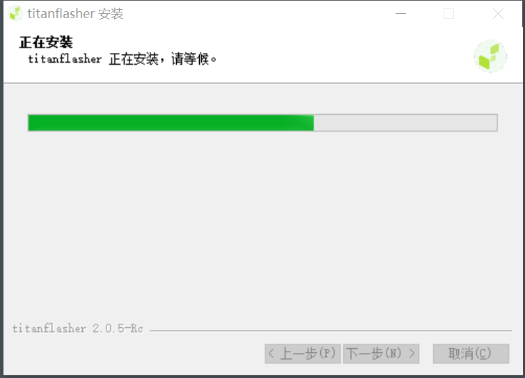

点击按键 **安装**，如下图。


点击按键 **完成** ，如下图，结束安装。


安装完成后，如下图所示，选择界面语言并启动工具


## 2.3 Linux 上安装

以 Ubuntu 为例。

1. 下载最新版本的刷机工具 [titantools\_for\_linux.AppImage](https://cloud.spacemit.com/prod-api/release/download/tools?token=titantools_for_linux_64BIT_APPIMAGE)
2. 赋予可执行权限
3. 双击即可开始使用，无需安装

> 注：如果启动失败报错："dlopen(): error loading libfuse.so.2" 可安装 libfuse 依赖:

```
sudo apt install libfuse2
```

## 3. 进入刷机模式

以下以进迭空间产品 **MUSE Pi** 为例

- **设备未上电**，处于关机状态时：

  1. 按住“下载（FDL）“按键不松开
  2. 插上电源线
  3. 松开“下载（FDL）“按键
  4. 插上 USB 数据线到刷机 USB 连接器，即可扫描到设备
- **设备已上电**，即设备已插上电源线上电，处于开机状态时：

  1. 按住 FDL 按键不松开；
  2. 短按 Reset 键；
  3. 松开 FDL 按键；
  4. 插上 USB 数据线到刷机 USB 连接器，即可扫描到设备

以下以进迭空间产品 **MUSE Book** 为例

- **激活 Fastboot 模式**
  使用取卡针长按 MUSE Book 右侧小孔内的 Fastboot 按钮，同时按下电源键开机。

> _注：需确保取卡针完全插入小孔并持续按压 3 秒以上_

- **设备连接**
  通过靠近屏幕侧的 Type-C 接口（OTG 专用端口），将 MUSE Book 与主机电脑连接。

## 4. 刷机过程

### 4.1 工具首页

1. 打开刷机工具，如果系统提示 **要允许来自未知发布者的此应用对你的设备进行更改吗？**，选择**是**。
2. 如下图所示，工具右侧展示了四个主要功能模块：

   - **研发工具**：单机烧录、卡启动。
   - **量产工具**：多机烧录、制作量产卡，写号工具，多机写号。
   - **在线云设备**：远程设备管理。
   - **设置**：更新工具版本和更改语言。
     点击不同的工具模块将跳转到对应的页面。


### 4.2 研发工具

在首页点击研发工具，跳转到研发工具界面。


#### 单机烧录

在研发工具页面有单机烧录选项和卡启动选项，这里选择单机烧录选项。

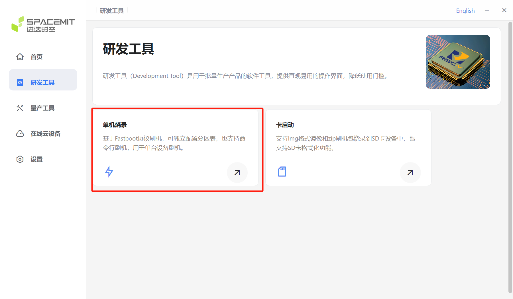

单机烧录流程如下：

1. 确保设备进入**刷机模式**

> 注：扫描设备前确保设备进入刷机模式，否则无法扫描成功。

2. 点击**扫描设备**，选择目标设备，如下图所示。


成功扫描到设备时，会出现下图类似的刷机序列号。


> 注：如下图所示，若存在多个设备，点击下拉按钮，即可进行设备选择。


3. 选择刷机文件（固件或解压目录）。

在识别到设备之后，如下图，选中位置可下拉选择文件路径来源。分别可以选择 **本地文件**、**本地目录**以及 **网络文件**。


4. 点击**开始刷机**，等待完成。

点击 **选择刷机文件**，选择固件，然后工具提示 **正在解压文件...**，耐心等待完成。（若需要配置分区，请浏览 **配置分区** 小节）


解压完成之后，下方显示刷机包名称


5. **刷机完成后重新上电。**

点击 **开始刷机**，启动刷机，如下图。


刷机完成，重新上电即可进入系统。


#### 卡启动

在研发工具界面选择 **卡启动** 选项，进入卡启动配置界面。

> 注：Linux 系统（如 Ubuntu）暂不支持当前卡启动功能。


卡启动的流程如下：

1. **插入 SD 卡，点击 选择 SD 卡**

- 在卡启动页面点击选择 SD 卡。
  > 注：在进行卡启动前，电脑需要插入 SD 卡。


- 点击选择 SD 卡之后，会弹出下图界面，选择 sd 卡。
  
- 选择 SD 卡之后，下图位置会显示选择的 SD 卡名称。


2. 选择刷机包路径。

- 选择 SD 卡之后，点击选择刷机包弹出下图选项，选择刷机包路径。
  
- 选择好刷机包之后，下图位置显示刷机包路径以及名称。
  

3. 选择操作类型
   选择刷机包之后，在下图位置选择需要进行的操作，默认选择烧录启动卡。

> 注：烧录启动卡前需要格式化 SD 卡，请提前做好备份，以免数据丢失


4. 点击 **执行**，等待烧录完成。

- 点击**执行**后，会弹出下图窗口，点击确定后，等待解压压缩包完成。
  
- 解压完成之后，开始烧写，等待烧写结束即可。
  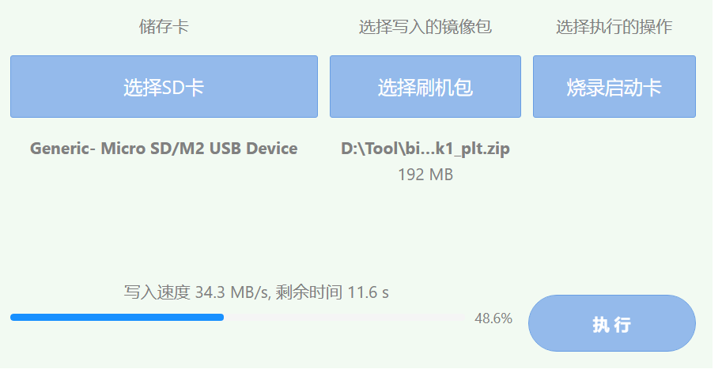

#### 配置分区

1. 在选择好烧录设备以及烧录固件之后，可根据需要配置分区文件。


2. 开启配置分区文件后，会弹出以下窗口，可选择或替换对应的分区文件。


3. 在选择好分区文件之后，会出现以下内容。

> 注：选择不同的分区文件，所对应的分区名会有所不一样，请确保分区文件不会产生冲突。

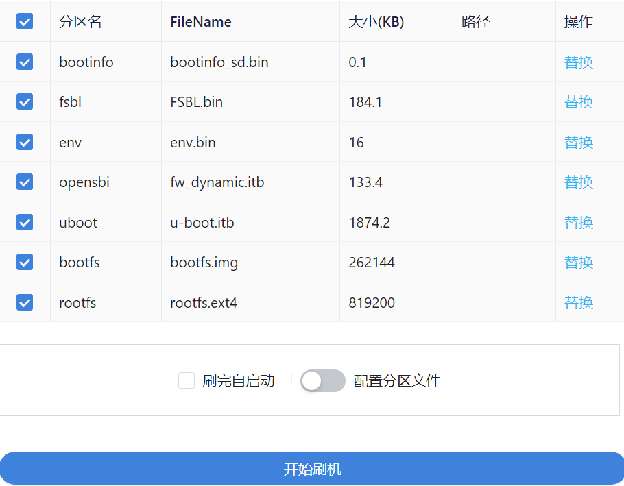

## 5. 量产工具

### 5.1 多机烧录

如下图所示，点击进入量产工具页面，选择 **多机烧录**。

> 注：多机烧录模式只支持 **zip 文件**。

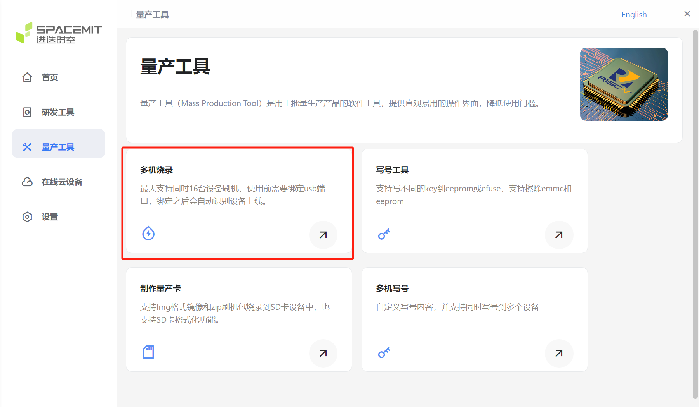

1. 选择多机烧录，然后点击**选择刷机文件**，如下图。

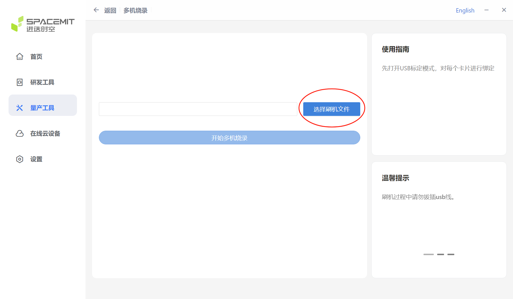

当选择好刷机文件并且解压完成之后，在下图位置显示解压好之后的文件路径。

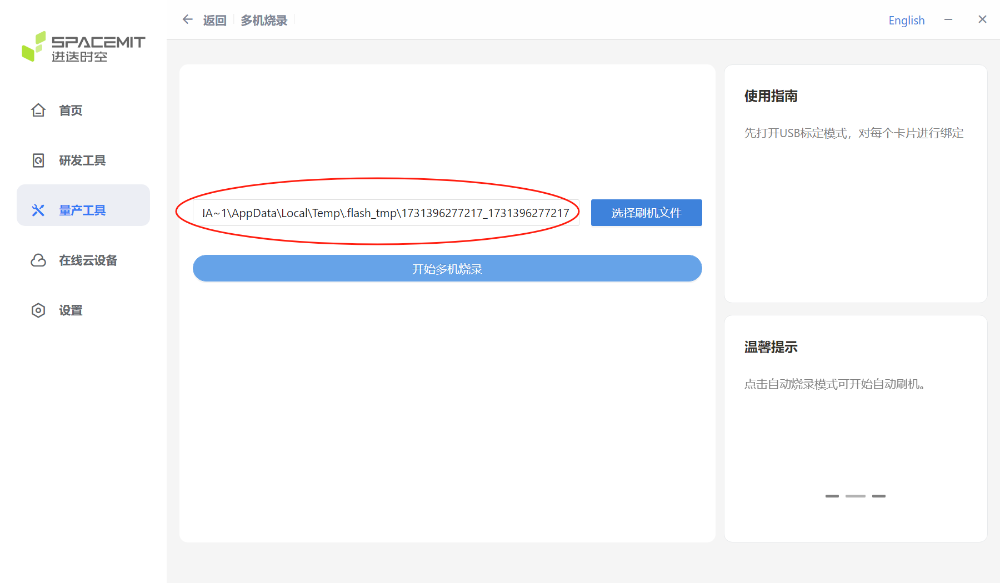

2. 开启 USB 标定模式，绑定 USB 端口。

- 点击开始多机烧录之后，会弹出多机烧录窗口，开启**USB 标定模式**，绑定 USB 端口。
  
- 绑定完成之后，下方显示对应的 USB 号。
  
- USB 绑定之后，关闭 USB 标定模式，等待检查到设备。USB 标定模式可对设备标定 USB 号，用于检测对应 USB 的烧录情况。
  
- 若需要解除绑定，重新打开 USB 标定模式，点击下图按钮即可，解除之后可以重新进行标定。
  

3. 选择自动或手动烧录模式。
   关闭 USB 标定模式，选择自动烧录或手动烧录，等待设备烧录完成。
   **注：**
   - 自动烧录模式即：若当前设备烧录完成之后，在不变更 USB 的情况下，继续使用该 USB 号连接新的设备时，继续烧录固件。
   - 手动烧录模式即：当前设备烧录完成后，手动控制是否继续烧录固件。
  

4. 烧录完成即可关闭窗口。
   
5. 若打开调试信息选项，将出现如下窗口。
   

### 5.2 制作量产卡

linux 平台，如 ubuntu 等系统，暂不支持量产卡功能

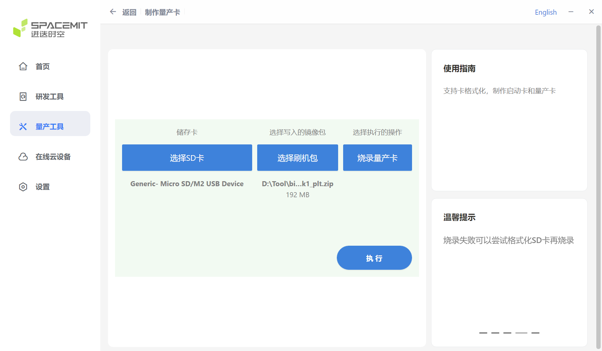

### 5.3 写号工具

1. 点击量产工具选择**写号工具**

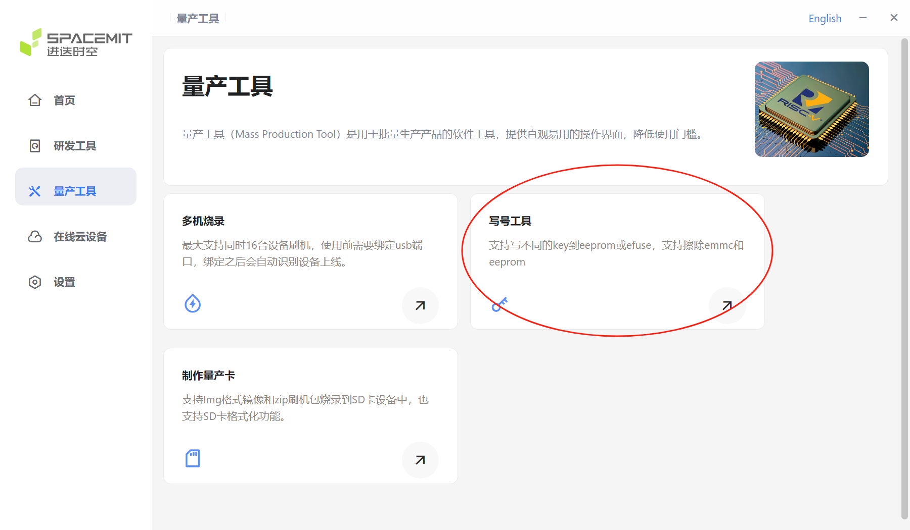

2. 点击**扫描设备**成功识别设备序列号


3. 点击**配置自定义字段**进入设置

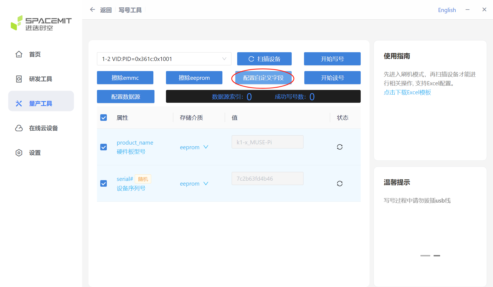

4. 启用需要写入的字段，不需要写入的字段禁用


5. 可以选择**随机 **或者** 自定义**


6. 设置完毕后点击**开始写号**等待写号成功即可

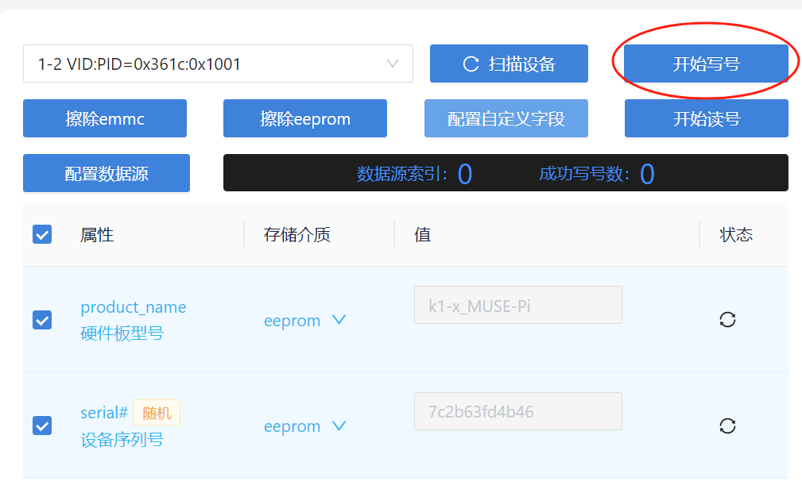


## 6. 在线云设备

用户可以通过此功能来进行远程设备管理。

点击此选项过，就进入登录页面，如下图。


> 注：此功能在维护中

## 7. 设置

下图为设置界面。

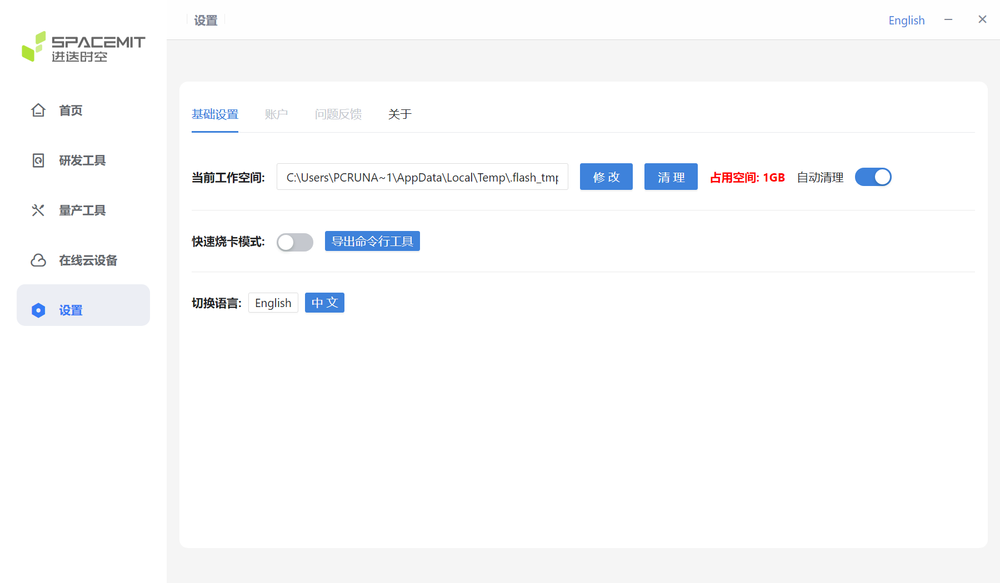

### 7.1 基础设置

#### 当前工作空间

下图红圈位置显示当前的工作空间。


- 若需要更换工作空间，可点击**修改**，重新选择工作空间。


- **清理占用空间如下步骤**

  1. 下图红圈位置显示当前工作空间占用的大小。
     
  2. 若点击**清理 **按键，将会弹出以下窗口，点击** Yes**，将清空当前工作空间的所有文件。
     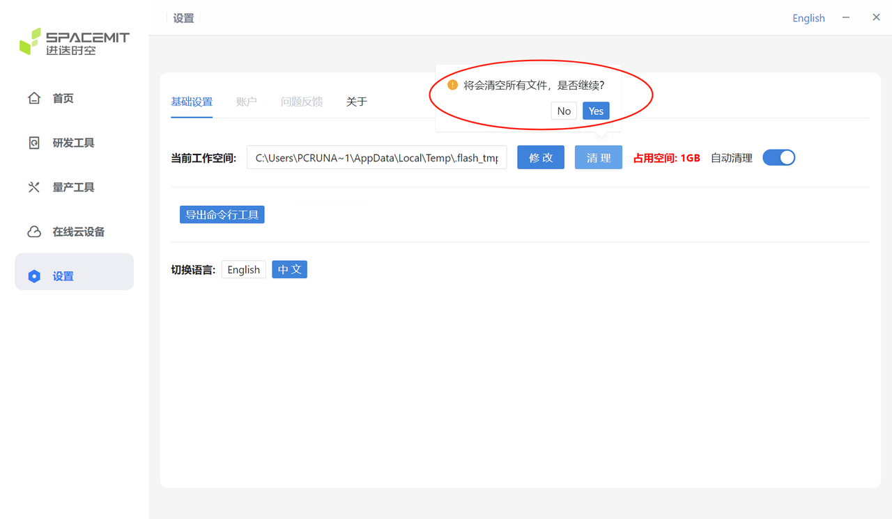
  3. 清理完成，显示当前占用空间为 0GB。
     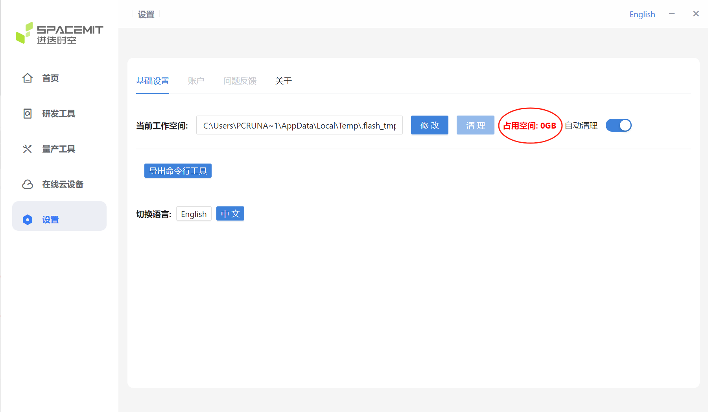
- **自动清理**
  自动清理功能会在**关闭工具时**自动清理工作空间中缓存的解压刷机文件。

  - 若未开启此功能，解压的刷机包将不会自动清理，可能导致缓存文件越积越多，占用大量磁盘空间。
  - 开启自动清理后，工具会在关闭时自动清理工作空间中的缓存文件，有效避免磁盘空间被过度占用。

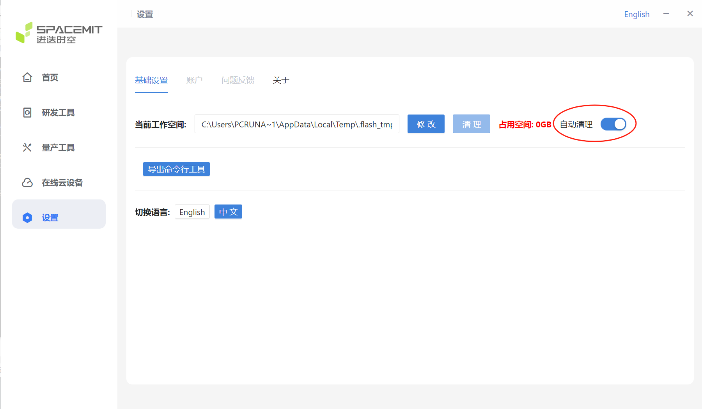

#### 切换语言

点击选项 **English** 和 **中文** 可以切换此工具的使用语言

### 7.2 关于 - 版本更新

点击**关于**，显示当前刷机工具套件的版本信息。

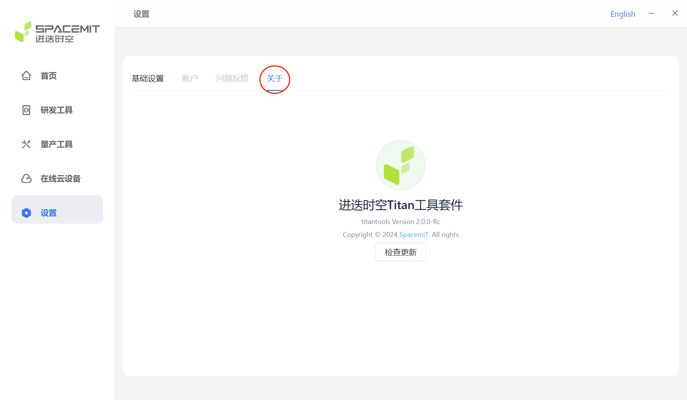

如下图，点击**检测更新**，检验当前版本是否为最新版本，若不是最新版本，将会弹出提示：**有新版本更新，请下载最新版本！**。


点击按键 **确定** 来开启版本更新。
