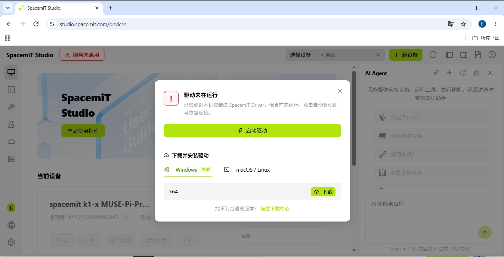
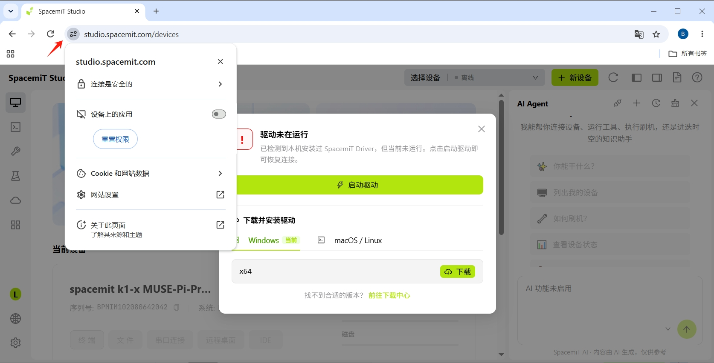
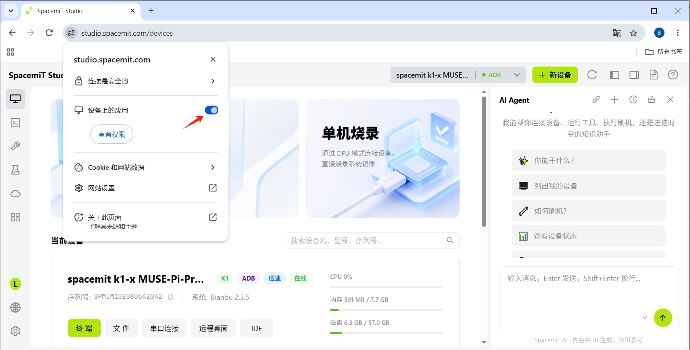

# 常见问题

## 安装与驱动

**Q：首次打开显示"服务未启动"？**

点击提示后在弹出的驱动安装引导窗口中选择**下载驱动**，下载并安装对应平台的驱动包。详见[快速入门 - 安装驱动](./quick_start.md#安装驱动)。

**Q：驱动安装后仍显示"服务未启动"？**

这是浏览器权限问题。启用 **"设备上的应用"** 权限即可解决：

1. 点击浏览器地址栏左侧的 **网站信息图标**
   
2. 在弹出的菜单中找到 **"设备上的应用"** 权限项
3. 将开关切换为**启用**（蓝色）
   
4. 刷新页面，驱动即可正常运行

如果找不到该权限项，可能需要先点击 **网站设置** 进入详细权限页面。

**Q：驱动安装后仍无法识别设备？**

- Windows：检查设备管理器中是否显示黄色感叹号，尝试右键更新驱动或重新安装
- Linux：确认当前用户具有 USB 设备访问权限（可能需要加入 `dialout` 或 `plugdev` 组）
- macOS：检查系统安全性与隐私设置中是否允许驱动运行

---

## 账号与登录

**Q：注册时收不到验证码？**

- 手机号注册：确认手机号正确且未被占用，检查短信是否被拦截
- 邮箱注册：检查垃圾邮件文件夹，确认邮箱地址正确

**Q：忘记密码怎么办？**

在登录页面点击**忘记密码**，通过注册时的手机号或邮箱重置密码。

---

## 设备连接

**Q：USB 连接后设备列表为空？**

- 确认 USB 线支持数据传输（非仅充电线）
- 确认设备已上电并进入正确模式
- Windows 用户检查设备管理器中驱动是否正常
- 尝试更换 USB 端口或重新插拔设备

**Q：SSH 连接超时或失败？**

- 确认设备与电脑在同一网络（可通过 `ping` 测试连通性）
- 检查设备端 SSH 服务是否已启动（串口登录后执行 `systemctl status ssh`）
- 确认 IP 地址、端口（默认 22）、用户名和密码正确
- 检查防火墙是否阻止了 SSH 端口

**Q：ADB 连接失败？**

- 确认设备已通过 USB 连接并被识别
- 检查设备上是否已启用 ADB 调试功能
- 尝试在终端面板中点击 **ADB** 按钮重新连接

---

## 烧录工具

**Q：烧录中断后如何恢复？**

重新进入烧录模式，重新选择镜像执行烧录即可。烧录工具会自动覆盖之前未完成的内容。

**Q：烧录完成后设备无法启动？**

- 检查镜像是否与设备型号匹配（如 K1 设备不能使用 K3 镜像）
- 确认镜像下载完整（查看镜像文件大小是否正常）
- 尝试使用最新版本镜像重新烧录
- 检查设备硬件是否正常（如电源、存储）

**Q：镜像下载失败或中断？**

- 检查网络连接是否稳定
- 尝试切换到其他网络环境重新下载
- 如多次失败，可手动下载镜像后通过**本地上传**功能导入

**Q：Linux 下 Firefox 同时下载多个镜像时请求失败怎么办？**

在 Linux 环境中，Firefox 的 HTTP/2 实现与本地服务（`https://127.0.0.1`）存在兼容性问题，同时下载多个镜像时可能导致请求失败。

**临时解决方案：** 
在 Firefox 地址栏输入 `about:config`，搜索 `network.http.http2.enabled`，将其设置为 `false`，然后重启 Firefox 浏览器。

**Q：SD 卡无法识别或格式化失败？**

- 确认 SD 卡已正确插入读卡器
- 检查 SD 卡容量是否满足镜像大小要求
- 尝试更换 SD 卡或读卡器
- Windows 用户可在磁盘管理中查看 SD 卡是否被识别
- 尝试先在系统中格式化 SD 卡为 FAT32 格式

**Q：分区配置后烧录失败？**

- 检查分区配置文件格式是否正确
- 确认分区大小总和不超过设备存储容量
- 尝试取消勾选**配置分区**，使用默认分区方案

---

## 终端与文件管理

**Q：终端连接后无法输入命令？**

- 检查设备连接状态是否正常（顶部显示为在线）
- 尝试按 Enter 键唤醒终端
- 如果是串口终端，尝试重新建立连接

**Q：文件上传或下载失败？**

- 确认设备存储空间充足
- 检查文件路径权限（可能需要 sudo 权限）
- 对于大文件，检查网络连接稳定性
- 尝试分批上传或使用压缩包

**Q：文件管理面板显示为空或无法刷新？**

- 检查设备连接状态
- 确认当前用户对目标目录具有读取权限
- 尝试切换到其他目录（如 `/home` 或 `/tmp`）后再返回

---

## 其他

**Q：如何切换界面语言？**

点击左下角语言图标或进入**设置 → 语言**切换中文/英文。

**Q：如何清理镜像缓存释放磁盘空间？**

进入**设置**，点击**镜像目录**或**解压目录**后的**清理**按钮。清理后如需使用须重新下载。

**Q：多设备同时连接如何切换？**

- 在顶部工具栏的**设备名称下拉框**中选择目标设备
- 或在**设备管理**页面点击目标设备卡片

**Q：遇到问题无法解决怎么办？**

- 查看设备的操作记录（设备管理 → 动态页面）获取错误日志
- 通过顶部工具栏的**意见反馈**提交问题