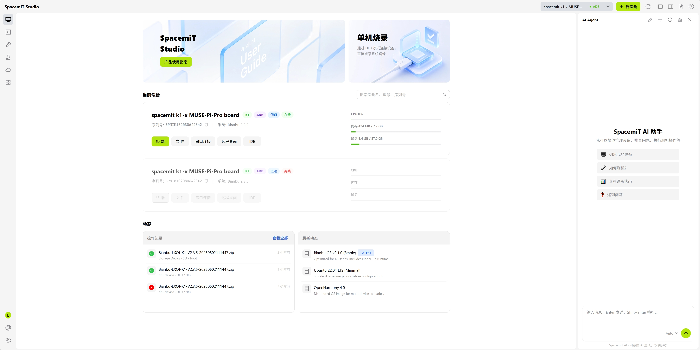

# 产品概述

**[SpacemiT Studio](https://studio.spacemit.com/)** 是由进迭时空为 RISC-V 平台打造的一站式开发工作台，集成镜像管理、系统烧录、设备管理、终端调试、云端编译、AI 开发和应用部署等能力，支持从系统安装到应用上线的完整开发流程。

它为 RISC-V 开发提供统一入口，帮助开发者在同一界面中完成设备准备、软件开发和应用部署。

## 界面概览

主界面包含导航栏、工具栏、设备区域和工作区，开发者可在同一窗口中完成设备连接、系统管理和调试操作。

## 适用场景

SpacemiT Studio 适用于以下场景：

- 系统准备与设备初始化：完成开发板烧录、网络配置和基础环境设置。
- 日常开发与调试：支持代码编写、编译构建、终端调试和文件同步。
- AI 应用构建与部署：支持 AI 模型加载、调试和端侧部署。

## 核心功能

### 智能烧录系统

支持向导式系统安装。连接设备后，工具可自动识别板型并推荐镜像版本，同时提供在线镜像管理、一键烧录，以及预置 SSH 密钥、Wi-Fi 凭证、主机名和用户密码等配置能力，并支持量产卡制作和写号。

### 一体化开发工作台

将设备管理、终端工具、文件管理、Web IDE、远程桌面和应用中心整合在同一界面中，减少工具切换。

### 云端开发环境

提供云端编译服务，支持 Makefile、CMake 和 Meson 等构建系统，帮助开发者在不同操作系统上获得一致的开发体验。

### AI 原生开发

集成 AI 开发助手、RAG 知识库和预置 Skill 能力库，支持 AI 模型部署和端侧应用开发。

## 系统要求

支持 Windows 10+、Ubuntu 20.04+ 和 macOS 11+。详细安装说明请参见[快速入门](./quick_start.md)。

