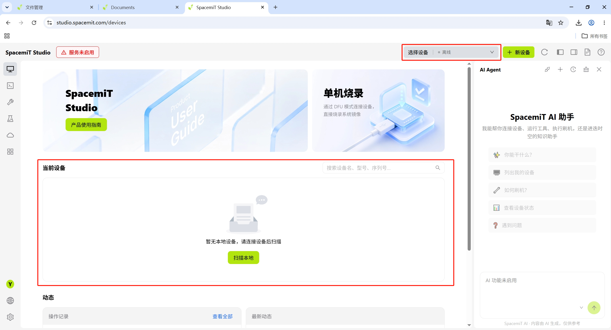
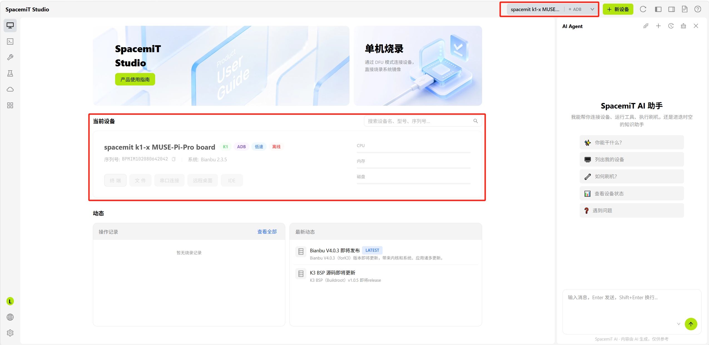
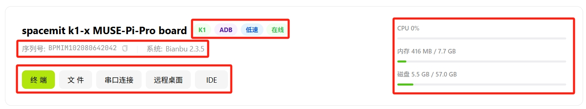
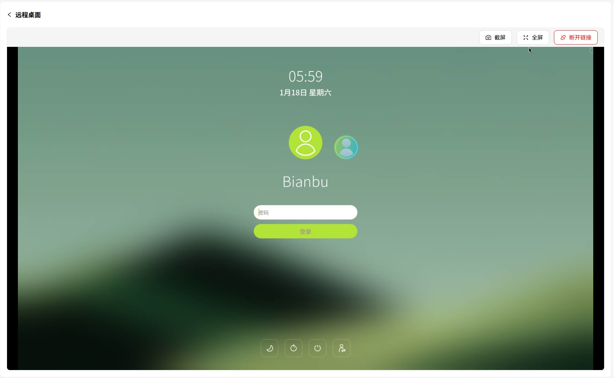
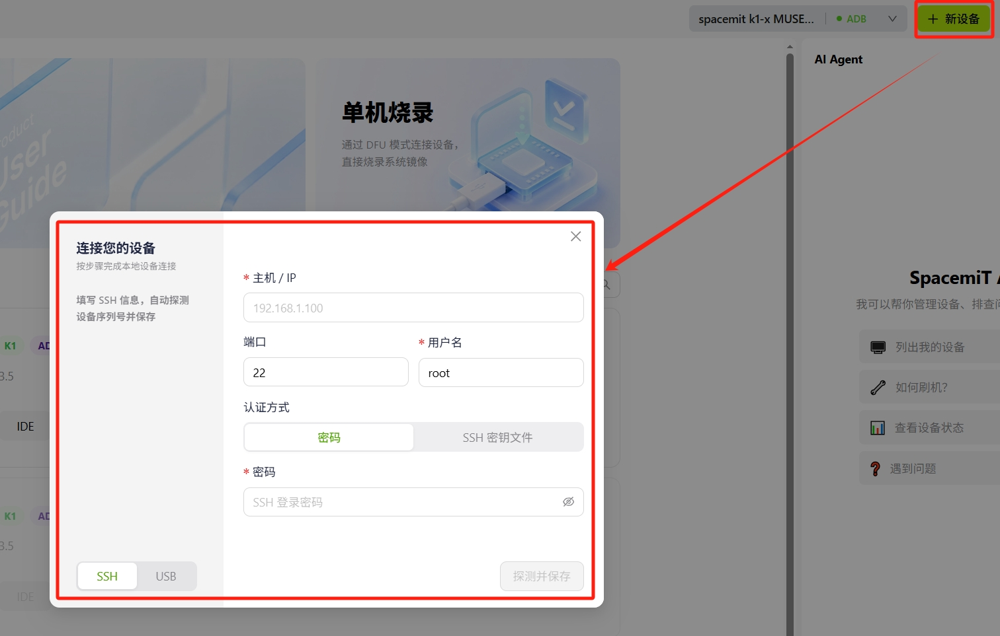
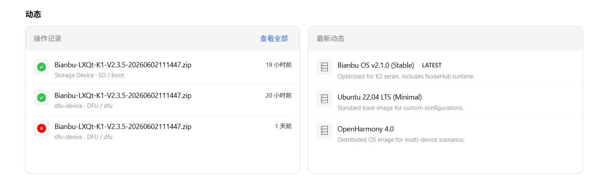

# 设备管理

## 概述

设备管理面板用于统一管理所有已连接的开发板，支持多设备同时接入、状态监控和快速切换。

## 支持设备

| 系列 | 型号 |
|------|------|
| K1 | MUSE Pi Pro、MUSE Pi、MUSE Book、MUSE Paper |
| K3 | CoM260 Kit、Pico-ITX |

## 设备连接

支持以下方式接入设备：

| 连接方式 | 适用场景 | 说明 |
|---------|---------|------|
| USB | 烧录、本地调试 | 通过 USB 线直连，免配置 |
| SSH | 日常开发、文件同步 | 通过网络远程连接，需设备已联网 |

### 连接前

未连接设备时，首页显示空状态

或者设备离线状态（以前连接过的设备）：

### 连接成功

设备连接成功后，首页将显示当前设备的详细信息：

## 设备操作

### 设备信息

连接成功后可查看以下信息：

- 设备系列与序列号
- 当前已安装的系统（如 Bianbu）
- 设备连接方式（如 ADB）
- 在线 / 离线状态
- CPU 使用率（实时）
- 内存使用量 / 总量
- 存储使用量 / 总量

### 快捷操作

设备面板底部提供常用操作快捷按钮：

- **[终端](./terminal.md#终端会话)**：打开设备终端会话
- **[文件](./terminal.md#文件管理)**：进入设备文件管理
- **[串口连接](./dev_tools/system_tools.md#串口连接)**：通过串口与设备通信，用于底层调试和日志查看
- **远程桌面**：通过 VNC/RDP 访问设备图形界面
   
- **IDE**：在 Studio 内打开设备的集成开发环境
   

### 重命名设备

支持对已连接设备自定义命名，便于多设备管理时区分：

  

### 新设备

如需增加新设备，可点击 **+新设备** 按键，在弹出的"连接您的设备"窗口中按步骤完成本地设备连接。
窗口底部切换可选择连接方式 USB 或 SSH。

  

## 动态

动态页面汇总两类信息：

  

- **操作记录**：当前设备的历史操作日志，包含固件包名称、操作方式、执行时间及成功/失败状态。点击右上角 **查看全部** 可展开完整历史记录
- **最新动态**：平台推送的更新资讯
