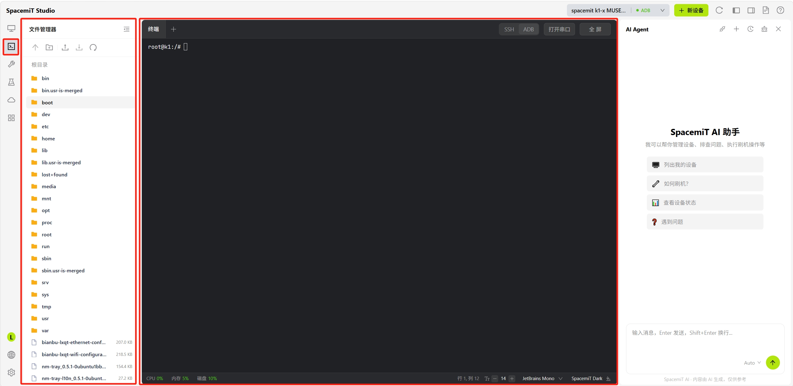
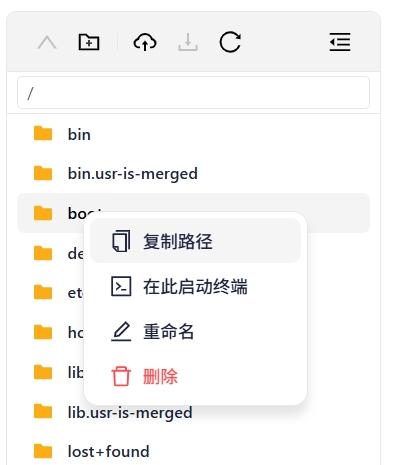
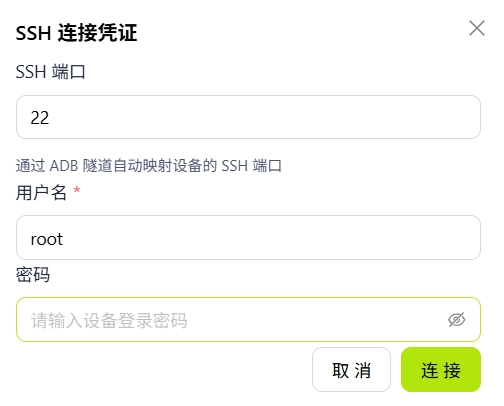
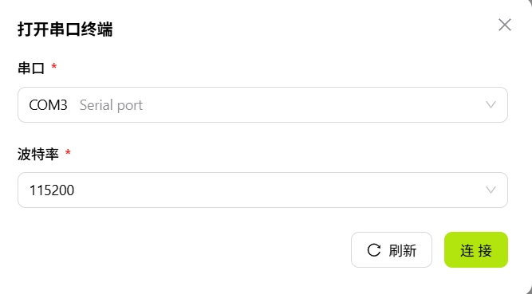

# 终端面板

终端面板提供集成的命令行环境，支持通过 SSH 或串口与设备交互，无需切换到外部终端工具。

> 注：设备需已经连接

## 文件管理

左侧的文件管理面板提供设备文件系统浏览能力。

面板顶部工具栏提供常用操作按钮，包括刷新目录、新建文件夹、上传文件、下载文件等。在文件或目录上右键可弹出上下文菜单，提供以下操作：

- **刷新**：刷新当前目录
- **新建文件夹**：在当前目录下新建文件夹
- **新建文件**：在当前目录下新建文件
- **下载**：将所选文件下载到本地

## 终端会话

右侧的终端会话区域提供命令行环境，支持多标签，每个标签对应一个独立会话。

### 工具栏

终端顶部工具栏包含以下操作：

- **+**：新建终端标签
- **SSH**：通过 SSH 连接设备，打开远程终端。点击后弹出配置窗口，填写 SSH 端口、用户名和密码后即可连接
  
- **ADB**：通过 ADB 协议连接设备，打开调试 shell
- **打开串口**：打开串口终端，用于查看启动日志和底层调试。点击后弹出配置窗口，选择串口设备并设置波特率等参数后连接
  
- **全屏**：将终端区域切换为全屏模式